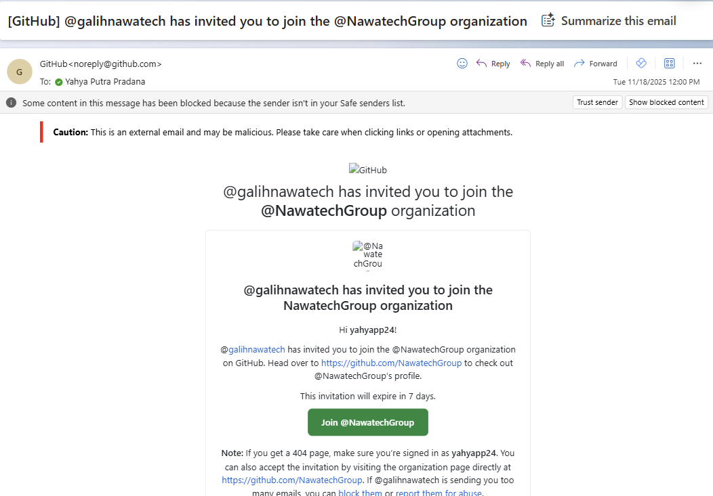

# Exercise 00: Prepare the Lab Prerequisites

## Why This Exercise Matters

A hands-on lab works only when every participant starts from exactly the same known state. This exercise ensures that: your cloud database is provisioned and seeded with data, your local tools are installed and working, and your AI services are reachable. Investing a few minutes here prevents you from stopping mid-exercise to troubleshoot a missing tool or an unreachable service.

Think of this exercise as a **preflight checklist**: pilots run one not because they doubt the aircraft, but because a systematic check before takeoff removes all uncertainty so the flight can proceed smoothly.

## What You Will Do

- Connect to your lab VM via RDP
- Confirm your lab credentials and accounts
- Clone the lab repository and verify local tools
- Confirm pre-provisioned Azure SQL Hyperscale access and capture your connection details
- Verify access to Azure SQL Hyperscale, Microsoft Foundry, and Microsoft Fabric

## What Will Be Ready When You Finish

By the end of this exercise you will have:

| Component | What it does in this lab |
|-----------|-------------------------|
| **Azure SQL Hyperscale** | Stores FAQ content and vector embeddings; serves as the retrieval backbone for the AI assistant |
| **VS Code SQL Server extension** | Lets you run T-SQL queries, browse the database, and connect to Azure SQL directly from your editor |
| **GitHub Copilot** | Accelerates SQL authoring in Exercises 2 and beyond |
| **Python + pip** | Runs the custom MCP server in Exercise 4 |
| **dotnet** | Runs Data API Builder (DAB) in Exercise 6 |
| **devtunnel** | Exposes your local MCP server to the internet in Exercise 4 so Microsoft Foundry can reach it |
| **`C:\LabFiles\sql_mcp_server`** | The pre-written Python MCP server code used in Exercise 4 |
| **`C:\LabFiles\sql-mcp-lab`** | The working folder where you configure and run DAB in Exercise 6 |

> [!Note]
> In the guided lab environment, many of these prerequisites (like the VM and Microsoft Foundry) are pre-provisioned for you. If you are running the lab in your own self-managed environment, ensure you complete every item in this checklist before continuing.

## Task 1: Connect to the VM and Confirm Credentials

Your workshop organizer provides a **credential sheet** at the start of the session. Additional shared service credentials are already available in `C:\creds.txt`.

1. Locate your credential sheet and confirm it contains the following:

    | Credential | Where it is used in this lab |
    | --- | --- |
    | **VM username and password** | Log into the Windows lab VM via RDP |
    | **Microsoft Entra ID account** | Azure Portal access, `az login` (Azure CLI), Microsoft Foundry (`https://ai.azure.com/`), Microsoft Fabric (`https://app.fabric.microsoft.com`), and dev tunnel sign-in in Exercise 4 |
    | **Your personal GitHub account** | GitHub Copilot sign-in in VS Code — used in Exercise 2 |

> [!Note]
> The following values are prepared for the lab and available in `C:\creds.txt`.
>
> | Variable | Description |
> | --- | --- |
> | `SQL_ADMIN` | SQL admin username (same for all participants) |
> | `SQL_PASSWORD` | SQL admin password (same for all participants) |
> | `LAB_INSTANCE_ID` | Unique 2-digit suffix used in all resource names and tunnel IDs |
> | `FOUNDRY_ENDPOINT` | Microsoft Foundry base endpoint |
> | `FOUNDRY_API_KEY` | Microsoft Foundry API key |
>
> `SQL_SERVER` (hostname) and `SQL_DB` (database name) are participant-specific. In Task 3 you will get them from Azure Portal by copying your database connection string and then paste them into `C:\creds.txt` for easier reuse.
>
> You can derive `LAB_INSTANCE_ID` from your participant email name:
> - `Nawa_MSPowerBI_1@nawadarsana.onmicrosoft.com` -> `LAB_INSTANCE_ID=01`
> - `Nawa_MSPowerBI_49@nawadarsana.onmicrosoft.com` -> `LAB_INSTANCE_ID=49`

Run `Get-Content C:\creds.txt` in any terminal to display all values.

2. Connect to the VM using your local Remote Desktop Protocol (RDP) client with the VM username and password from your credential sheet.
3. Confirm that you can open the following in the VM's browser:
    - Microsoft Foundry at `https://ai.azure.com/`
    - Microsoft Fabric at `https://app.fabric.microsoft.com`

## Task 2: Accept Your GitHub Copilot Invitation and Configure VS Code

> [!Important]
> **Accept your GitHub organization invitation before signing into VS Code with GitHub.** The workshop organizer has invited your personal GitHub account to an organization that provides GitHub Copilot access. If you sign into VS Code before accepting the invitation, Copilot may not activate — and you would need to sign out and back in again to pick up the benefit.

1. **Accept the GitHub invitation (do this first):**
    1. Check your personal email inbox for an invitation from GitHub with a subject similar to *"[GitHub] @nawatech has invited you to join the @NawatechGroup organization"*.

         
    
    1. Open the email and select **Join @NawatechGroup**.
    1. On the GitHub invitation page, select **Accept invitation**.
    1. Confirm the organization appears in your GitHub profile at `https://github.com/settings/organizations`.

> [!Note]
> If you do not see the invitation, check your spam folder. Contact the workshop organizer if it has not arrived.

2. Open **Visual Studio Code** from the desktop or start menu.
3. Sign in to VS Code with your GitHub account:
    1. Select the **Accounts** icon in the bottom-left Activity Bar (person silhouette).
    1. Select **Sign in with GitHub** and follow the browser prompts to authorize VS Code.
    1. Once signed in, confirm that **GitHub Copilot** and **GitHub Copilot Chat** appear as active extensions in the Extensions view (`Ctrl`+`Shift`+`X`).

> [!Note]
> Because you accepted the organization invitation in the previous step, Copilot should activate automatically. If you see a "No active Copilot subscription" message, sign out and sign in again to refresh the entitlement.

4. Open the **Source Control** view by selecting the Source Control icon in the Activity Bar or pressing `Ctrl+Shift+G`.
5. Select **Clone Repository**.
6. Enter `https://github.com/NawatechGroup/build26-lab513.git` and press **Enter**.
7. Select `C:\` as the destination and select **Select Repository Location**.
8. When prompted, select **Open** to open the cloned folder in VS Code.

Alternatively, clone from the command line:

```powershell
# Clone directly to C:\build26-lab513
git clone https://github.com/NawatechGroup/build26-lab513.git C:\build26-lab513

# Open the cloned folder in VS Code
code C:\build26-lab513
```

9. Confirm that the following tools are pre-installed on the lab machine:

    ```powershell
    python --version
    pip --version
    dotnet --version
    devtunnel --version
    ```
    *(If any command fails, install the missing tool before moving to the next task.)*

> [!Tip]
> **Why these specific tools?**
> - **Python + pip** — The custom MCP server in Exercise 4 is a Python script. pip installs its dependencies.
> - **dotnet** — Data API Builder (DAB) in Exercise 6 is a .NET global tool. You install and run it with the `dotnet` CLI.
> - **devtunnel** — When the MCP server runs on your local machine, Microsoft Foundry (a cloud service) cannot reach `localhost`. Dev Tunnel creates a secure HTTPS forwarding URL that bridges your local process to the public internet.

## Task 3: Collect Azure SQL Hyperscale Connection Details (Pre-Provisioned)

Azure SQL Hyperscale and seed data are pre-provisioned by the workshop organizer. In this task, you will collect your participant-specific SQL hostname/database info and configure networking access from the lab VM.

1. Sign in to Azure from the terminal using device-code authentication (recommended for lab VMs without a browser session):

    ```powershell
    az login --use-device-code
    ```

    Confirm your subscription appears in `az account list` or in the Azure extension.

2. Open Azure Portal (`https://portal.azure.com`) and locate the Azure SQL logical server assigned to your participant account.
3. On the SQL server resource, go to **Networking**:
    - Add a firewall rule for your lab VM client IP.
    - Enable **Allow Azure services and resources to access this server**.

4. From that SQL server, open the associated Azure SQL database (Hyperscale), then open **Connection strings**.
5. Copy a connection string, for example:

    ```text
    Server=tcp:<server-name>.database.windows.net,1433;Initial Catalog=<db-name>;Encrypt=True;TrustServerCertificate=False;Connection Timeout=30;Authentication="Active Directory Default";
    ```

6. Map the connection string to lab variables and save them in `C:\creds.txt`:
    - `SQL_SERVER=<server-name>.database.windows.net` (from the `Server=tcp:...` value, without `tcp:` and without `,1433`)
    - `SQL_DB=<db-name>` (from `Initial Catalog=...`)
    - Optional: keep the full value as `SQL_CONNECTION_STRING=...`

    `SQL_SERVER` and `SQL_DB` are different for each participant.

## Task 4: Verify Local Files and Working Paths

Use this time to verify your local environment. The two directories below serve specific purposes in later exercises:

- **`C:\LabFiles\sql_mcp_server`** — Contains the pre-written Python MCP server (`server.py`) and its dependency list (`requirements.txt`). You will run this server in Exercise 4 to expose FAQ retrieval as an MCP tool that Foundry Agents can call.
- **`C:\LabFiles\sql-mcp-lab`** — An initially empty working folder. In Exercise 6 you will initialize Data API Builder here and configure it to expose Azure SQL Hyperscale as a standardized MCP endpoint.

After collecting your SQL connection details, confirm that your local environment has the required directories for the upcoming exercises.

1. Verify the required VS Code extensions are pre-installed:
    1. Open the **Extensions** view (`Ctrl+Shift+X`).
    1. Search for `SQL Server` and confirm **SQL Server (mssql)** shows as installed.
    1. Search for `GitHub Copilot` and confirm **GitHub Copilot Chat** shows as installed.

> [!Note]
> All required extensions are pre-installed on the lab VM. If any extension is missing, contact the workshop organizer.
2. Confirm that the local MCP sample folder and the working folder for Exercise 6 exist:
    1. Select **File** > **Open Folder** and navigate to `C:\LabFiles`.
    1. Select **Select Folder** to open it in VS Code Explorer.
    1. In the **Explorer** view, confirm the following items are present:
        - `sql_mcp_server/` folder
        - `sql_mcp_server/requirements.txt`
        - `sql_mcp_server/server.py`
        - `sql-mcp-lab/` folder
    1. After confirming, select **File** > **Open Recent** and reopen `C:\build26-lab513` to return to the lab repository.

    *(If you are using a self-managed environment, create `C:\LabFiles\sql-mcp-lab` and place the required MCP server files in `C:\LabFiles\sql_mcp_server` before continuing).*

## Task 5: Verify Azure SQL and Cloud Services

1. **Review your `{LAB_INSTANCE_ID}` and SQL details:** Derive `LAB_INSTANCE_ID` from your participant email name, then open `C:\creds.txt` and confirm `LAB_INSTANCE_ID`, `SQL_ADMIN`, `SQL_PASSWORD`, `SQL_SERVER`, and `SQL_DB` are available. If helpful, also keep `SQL_CONNECTION_STRING` in this file.

    Examples:
    - `Nawa_MSPowerBI_1@nawadarsana.onmicrosoft.com` -> `LAB_INSTANCE_ID=01`
    - `Nawa_MSPowerBI_49@nawadarsana.onmicrosoft.com` -> `LAB_INSTANCE_ID=49`

    ```powershell
    Get-Content C:\creds.txt
    ```

2. **Verify Microsoft Foundry:** Go back to `https://ai.azure.com/` and confirm you can access the `workshop-ai-foundry-project`.
3. **Verify Microsoft Fabric:** Go to `https://app.fabric.microsoft.com` and confirm you can create a new workspace. You will use a workspace named `FAQ-Workspace-{LAB_INSTANCE_ID}` in Exercise 5.

## Task 6: Final Readiness Check

Before moving on, verify that all of the following are true:

- You have accepted the GitHub organization invitation in your email
- You can sign in to Azure with `az login` (for Azure CLI operations)
- Visual Studio Code opens and the SQL Server and GitHub Copilot extensions are available
- `python`, `pip`, `dotnet`, and `devtunnel` run successfully in the terminal
- `C:\creds.txt` exists and includes SQL username/password, Foundry endpoint/key, and your participant-specific SQL hostname/database (or full connection string)
- Azure SQL server firewall allows your VM IP, and **Allow Azure services and resources to access this server** is enabled
- The lab repository is cloned, and `C:\LabFiles\sql-mcp-lab` and `C:\LabFiles\sql_mcp_server` exist
- Microsoft Foundry opens the `workshop-ai-foundry-project`
- Microsoft Fabric is available for workspace creation

If every item is ready, continue to the first hands-on exercise.

Next → [1. AI-Enhanced Querying with Azure SQL Hyperscale](../Instructions/exercise-01.md)
