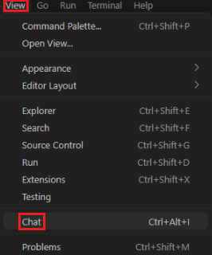

# Exercise 2: Accelerate SQL Development with GitHub Copilot

## Why This Exercise Matters

In Exercise 1 you ran pre-built queries and a pre-built stored procedure. In real projects, you write that SQL from scratch — and that is where GitHub Copilot changes the workflow.

Copilot does not replace your SQL expertise. Instead, it acts as a **knowledgeable pair programmer** that drafts boilerplate quickly, explains unfamiliar patterns, and suggests improvements you might not have considered. Your role shifts from syntax recall to **critical review**: reading what Copilot generates, validating it against your schema and requirements, and refining it until it is correct and production-ready.

This exercise teaches that discipline. You will ask Copilot to generate a semantic search query, then compare it against the validated version from Exercise 1. That comparison teaches you both what Copilot gets right and where to apply your own judgment.

## By the End of This Exercise, You Will Be Able To

- Use GitHub Copilot Chat in Visual Studio Code
- Ask Copilot to generate a semantic search query
- Ask Copilot to explain and improve SQL
- Refine AI-generated SQL before using it in the lab

> **Key Mental Model: Copilot as a Draft, You as the Editor**
>
> AI-generated SQL can be subtly wrong in ways that compile and run but return incorrect results. Always validate:
> - Are the table and column names correct for **your** schema?
> - Is the `VECTOR_DISTANCE` argument order correct? (Azure SQL expects the metric first, then the two vectors.)
> - Does the query return the right number of rows in the right order?
> - Would this run safely in production (no missing filters, no unbounded scans)?
>
> Copilot is fastest when you already know what correct looks like — this exercise gives you that baseline.

## Task 1: Confirm GitHub Copilot Is Active

> [!Important]
> **Reminder:** Accepting the GitHub organization invitation and signing into VS Code with your GitHub account were covered in [Exercise 0, Task 2](../Instructions/exercise-00.md#task-2-accept-your-github-copilot-invitation-and-configure-vs-code). If you have not completed those steps yet, do so now before continuing.
>
> - Accept the invitation from your email inbox (subject: *"[GitHub] @nawatech has invited you to join the @NawatechGroup organization"*).
> - Sign into VS Code using the **Accounts** icon in the lower-left activity bar → **Sign in with GitHub**.
> - Visit `https://github.com/settings/copilot` to verify your account has an active Copilot subscription.

1. Open Copilot Chat (`Ctrl+Alt+I`) and confirm the chat pane opens without a sign-in prompt. If you see a "No active Copilot subscription" message, sign out and sign back in to refresh the entitlement.

## Task 2: Generate a Semantic Search Query

**Why generate a query you already have?** Because the process of asking Copilot, reviewing what it produces, and comparing it to the known-correct version builds intuition for what good AI-generated SQL looks like. You are not looking for a shortcut here — you are developing a review muscle.

1. Open a new SQL query window by selecting **View** > **Command Palette** > `MS SQL: New Query`.

1. Open Copilot Chat in Visual Studio Code. If the chat pane is not visible, select `View`, then select `Chat`.

    

1. Enter a prompt like the following:

    ```text
    Generate a T-SQL query for Azure SQL that returns the top 3 FAQ items most relevant to a customer question by using dbo.FAQ_Content and dbo.FAQ_Embeddings.
    ```

    If you see a permission prompt, select `Allow in this Session`.

    

1. Review the SQL returned by Copilot. Note any assumptions it made — for example, column names it guessed, embedding logic it invented, or placeholders it left in.

1. Now try a more structured prompt that applies **prompt engineering** principles. In Copilot Chat, enter this prompt instead:

    ```text
    I need you to generate a T-SQL query for Azure SQL that returns the top 3 FAQ items most relevant to a customer's question, using semantic/vector search against dbo.FAQ_Content and dbo.FAQ_Embeddings.

    IMPORTANT: You must use the connected mssql tool to inspect the actual database before writing any code. Do not guess, assume, or invent any table names, column names, data types, or existing infrastructure (such as embedding endpoints, stored procedures, or vector columns).

    Please follow these steps, using the mssql tool at each step:
       - Accept a customer question as an input variable
       - Convert that question into an embedding vector using a REST call to an Azure AI Foundry embedding model deployment endpoint (put endpoint and credentials as placeholders in the code)
       - Compare that embedding against the embedding column in FAQ_Embeddings using an appropriate vector distance/similarity function
       - Join back to FAQ_Content to return the top 3 most relevant FAQ rows with all relevant display columns
    ```

1. Compare the two results side by side. Notice the differences that the more structured prompt produces:

    - Did the second prompt cause Copilot to inspect the actual schema first, instead of guessing column names?
    - Does the second result correctly reference the embedding endpoint as a placeholder rather than hardcoding a value?
    - Is the join logic and `VECTOR_DISTANCE` usage more accurate?

    > **Prompt Engineering Takeaway:** Vague prompts produce generic drafts. Prompts that specify *what to inspect*, *what not to assume*, and *the exact steps to follow* give Copilot the constraints it needs to produce code that is closer to production-ready. The second prompt is longer, but the review effort it saves is larger.

1. Review the SQL returned by the second prompt. Do not run it yet — check whether it includes:

    - `dbo.FAQ_Content`
    - `dbo.FAQ_Embeddings`
    - A join on `faq_id`
    - `TOP 3`
    - `VECTOR_DISTANCE`

1. Copy the Copilot-generated SQL into your query window or SQL file.
1. Compare the Copilot-generated SQL with the semantic search query from Exercise 1.

    - Look for similarities and differences.
    - Notice whether Copilot used the correct `VECTOR_DISTANCE` argument order.

    > [!Important]
    > Azure SQL expects the metric as the first argument to `VECTOR_DISTANCE`, followed by the two vector values. If needed, keep the lab's validated query as the final version.

1. Ask Copilot to Explain the Query. In Copilot Chat, enter a prompt like the following:

    ```text
    Explain this SQL query step by step for someone who is new to vector search in Azure SQL.
    ```

1. Review the explanation. Notice how Copilot breaks down:

    - The join between the two tables
    - The similarity calculation
    - Why the results are ordered by vector distance

1. Ask Copilot to Improve Readability. In Copilot Chat, enter a prompt like the following:

    ```text
    Rewrite this query to make it easier to read for a lab demo. Add clean formatting and brief comments.
    ```

1. Copy the improved version into your SQL file.

## Task 3: Ask Copilot for Schema Suggestions

**Why ask an AI about your schema?** Schema design has long-term consequences — a poorly designed index, a missing foreign key, or an overly wide table column type can quietly degrade performance as data grows. Copilot has been trained on a large body of SQL best practices and can surface suggestions you might not think of in the moment. Treat the suggestions as a checklist to review, not a prescription to blindly apply.

1. In Copilot Chat, enter a prompt like the following:

    ```text
    By using mssql tool, review the schema for dbo.FAQ_Content and dbo.FAQ_Embeddings and suggest improvements.
    ```

1. Review the suggestions. Look for ideas such as:

    - Readability and documentation improvements
    - Indexing considerations
    - Separation of content and embeddings
    - Column type suggestions

## Task 4: Ask Copilot to Draft a Stored Procedure

**Why draft a stored procedure with Copilot?** Stored procedures are reusable SQL units that encapsulate complex logic. In Exercise 3, the `dbo.SearchFAQ` procedure is the backbone of the RAG workflow. Drafting a similar procedure with Copilot shows you how quickly you could build or extend such components in a real project — and practises the review discipline from Task 2 at a larger scale.

1. In Copilot Chat, enter a prompt like the following:

    ```text
    Generate a stored procedure draft for Azure SQL called dbo.usp_GetTopFaqMatches that returns the most relevant FAQ rows for a user question.
    ```

1. Review the stored procedure returned by Copilot.

    > [!Note]
    > You do not need to deploy it yet. This step demonstrates how Copilot can accelerate repeatable SQL authoring patterns.

## Task 5: Wrap Up

1. Ask one final prompt.

    ```text
    Summarize in 3 bullet points how GitHub Copilot helped improve SQL development in this exercise.
    ```

1. Review the summary. Copilot should help with:

    - Generating SQL
    - Explaining SQL
    - Refining SQL structure

Next → [3. Implement Retrieval-Augmented Generation (RAG) with Azure SQL Hyperscale](../Instructions/exercise-03.md)
