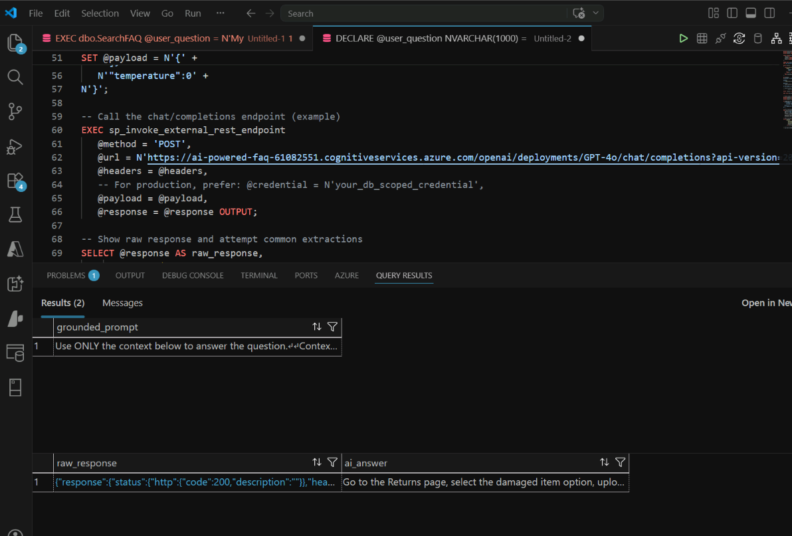
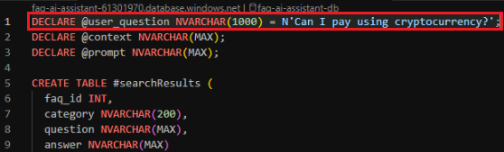

# Exercise 3: Implement Retrieval-Augmented Generation (RAG) with Azure SQL Hyperscale

## Why This Exercise Matters

Large language models are excellent at producing fluent, confident-sounding text. That fluency is also their biggest risk: when they do not know the answer, they often make one up. This is called **hallucination**, and in a customer support context it is dangerous — a model might invent a refund policy that does not exist or describe a process that is completely wrong.

**Retrieval-Augmented Generation (RAG)** solves this by changing how you use the model. Instead of asking the model to answer from memory, you:
1. **Retrieve** verified facts from your database (the FAQ content)
2. **Augment** the model's input with those facts as context
3. **Generate** an answer that is explicitly constrained to that context

Think of it like an open-book exam versus a closed-book exam. In a closed-book exam the model relies on memorized (and potentially wrong) knowledge. In an open-book exam the model reads your data and answers based on that — and if the answer is not in the book, it says so.

**Why implement RAG inside Azure SQL?** Most RAG tutorials place the retrieval in application code: query a vector database, build a prompt, call the model. Azure SQL Hyperscale lets you do all of this inside a SQL stored procedure using `sp_invoke_external_rest_endpoint`. This is powerful because:
- The retrieval and prompt assembly logic lives in the database, close to the data
- Any consumer (Python app, .NET service, Power BI, Foundry Agent) can call one stored procedure and get a grounded answer
- The logic is version-controlled alongside the schema

## What You Will Do

- Pass a natural language question
- Retrieve the most relevant FAQ entries from Azure SQL Hyperscale
- Assemble the retrieved answers into a grounding context
- Build a grounded prompt inside SQL
- Send the prompt to GPT-5-mini
- Review the AI-generated answer

## By the End of This Exercise, You Will Understand

How Azure SQL Hyperscale supports retrieval and prompt orchestration in a RAG workflow, and why grounding the model's input in verified data reduces hallucinations.

## Scenario

Contoso Support wants to build an FAQ assistant that answers customer questions by using only approved support content.

To accomplish this, the system must:

1. Accept a user question in natural language.
1. Retrieve relevant FAQ records.
1. Combine those records into a grounding context.
1. Build a prompt for an AI model.
1. Generate a grounded response by using GPT-5-mini.

## Task 1: Retrieve FAQ Data and Build the Grounding Context

The script in this task does three things that are worth understanding separately:

1. **Calls `dbo.SearchFAQ`** — This runs the semantic search you explored in Exercise 1. It returns the top 3 most relevant FAQ entries for the user's question.

2. **Builds a context string with `STRING_AGG`** — The FAQ entries are concatenated into a single block of text. This is the "open book" the model will read. Notice the format: `Question: ... Answer: ...` repeated for each entry. Formatting matters — the model reads this as structured context, not raw data.

3. **Builds a grounded prompt** — The prompt includes an explicit instruction: *"Use ONLY the context below to answer the question."* This instruction is what enforces grounding. Without it, the model would blend your FAQ data with its own training knowledge, which might be wrong or outdated.

1. Open a new SQL query window in Visual Studio Code by selecting **View** > **Command Palette** > `MS SQL: New Query`.

1. Execute the stored procedure that retrieves relevant FAQ matches.

    ```sql
    EXEC dbo.SearchFAQ @user_question = N'My product arrived damaged';
    ```

1. Review the results. You should see top matches such as:

    - `How do I return a damaged item?`
    - `What if I received the wrong item?`

1. Build the grounding context from the same retrieval flow.

    ```sql
    DECLARE @user_question NVARCHAR(1000) = N'My product arrived damaged';
    DECLARE @context NVARCHAR(MAX);
    DECLARE @prompt NVARCHAR(MAX);
    
    CREATE TABLE #searchResults (
        faq_id INT,
        category NVARCHAR(200),
        question NVARCHAR(MAX),
        answer NVARCHAR(MAX)
    );
    
    INSERT INTO #searchResults (faq_id, category, question, answer)
    EXEC dbo.SearchFAQ @user_question = @user_question;
    
    SELECT @context =
    (
        SELECT STRING_AGG(
            CONCAT(
                'Question: ', question, CHAR(10),
                'Answer: ', answer
            ),
            CHAR(10) + CHAR(10)
        )
        FROM #searchResults
    );
    
    SET @prompt =
    N'Use ONLY the context below to answer the question.
    Context:
    ' + ISNULL(@context, N'No relevant FAQ context found.') + N'
    Question:
    ' + @user_question + N'
    If the answer is not in the context, say you do not know.';
    
    SELECT @prompt AS grounded_prompt;
    
    DROP TABLE #searchResults;
    ```

1. Run the script and review the `grounded_prompt` result in text view. The prompt contains:

    - The retrieved FAQ context
    - The user question
    - Instructions that force the AI to stay grounded in the data

## Task 2: Send the Prompt to GPT-5-mini

> **Concept: `sp_invoke_external_rest_endpoint`**
>
> This is a built-in Azure SQL stored procedure that lets SQL call any HTTPS API and capture the response. It handles the HTTP request, passes headers and a JSON payload, and returns the raw JSON response. This means Azure SQL can call Azure OpenAI, logic apps, custom APIs, or any REST service — without requiring middleware or a separate application layer.
>
> In this task you use it to call the Azure OpenAI Chat Completions API. The payload follows the standard OpenAI messages format: a system message sets the assistant's behavior, and a user message contains the grounded prompt you assembled in Task 1. The model's response comes back as JSON, and `JSON_VALUE` extracts the answer text.

1. Append a chat-completions call pattern to the same query window so Azure SQL Hyperscale can call the model with the grounded prompt.

    > [!Important]
    > Before running the script below, replace the two placeholder values with the credentials from your credential sheet:
    > - `<YOUR_FOUNDRY_API_KEY>` → your **Microsoft Foundry API key**
    > - `<YOUR_FOUNDRY_ENDPOINT>` → your **Microsoft Foundry endpoint** (the hostname only, e.g. `your-resource.openai.azure.com`)

    ```sql
    DECLARE @payload NVARCHAR(MAX);
    DECLARE @response NVARCHAR(MAX);
    DECLARE @headers NVARCHAR(MAX) = N'{"api-key": "<YOUR_FOUNDRY_API_KEY>"}';
    
    SET @payload = N'{' +
    N'"messages":[' +
    N'{"role":"system","content":"You are a helpful assistant that answers questions by using only approved FAQ context."},' +
    N'{"role":"user","content":"' + STRING_ESCAPE(@prompt, 'json') + N'"}' +
    N']' +
    N'}';
    
    EXEC sp_invoke_external_rest_endpoint
        @method = 'POST',
        @url = N'https://<YOUR_FOUNDRY_ENDPOINT>/openai/deployments/gpt-5-mini/chat/completions?api-version=2024-10-21',
        @headers = @headers,
        @payload = @payload,
        @response = @response OUTPUT;
    
    SELECT
        @response AS raw_response,
        COALESCE(
            JSON_VALUE(@response, '$.result.choices[0].message.content'),
            JSON_VALUE(@response, '$.choices[0].message.content'),
            JSON_VALUE(@response, '$.output[0].content[0].text'),
            @response
        ) AS ai_answer;
    ```

1. Run the script and review the response.

    

1. Change the user question.

    ```sql
    DECLARE @user_question NVARCHAR(1000) = N'How do I track my order?';
    ```

1. Run the script again and review the updated outputs:

    - Retrieved context
    - Grounded prompt
    - AI answer

1. Now, try a question that may not exist in the FAQ.

    ```sql
    DECLARE @user_question NVARCHAR(1000) = N'Can I pay using cryptocurrency?';
    ```

    

1. Run the script again and review the results.

    - If the FAQ does not contain relevant information, the model should answer with a grounded fallback such as `I do not know.` This demonstrates how RAG grounding helps reduce hallucinations.

    

## What You Built

1. You implemented a complete RAG workflow by using Azure SQL:

    ```text
        User question
        -> Azure SQL retrieval
        -> Top FAQ rows
        -> Context assembly
        -> Grounded prompt
        -> GPT-5-mini generation
        -> Grounded AI answer
    ```

Next → [4. Orchestrate the AI FAQ Workflow with Microsoft Foundry Agents](../Instructions/exercise-04.md)
