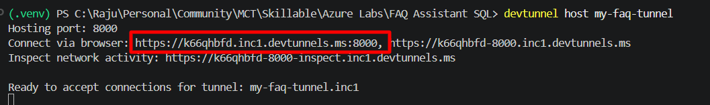
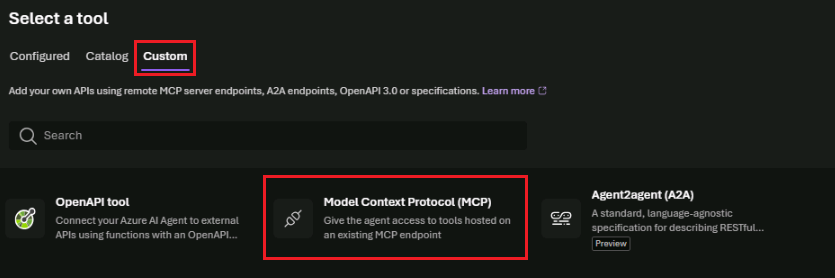

# Exercise 4: Orchestrate the AI FAQ Workflow with Microsoft Foundry Agents

## Why This Exercise Matters

In Exercise 3, you orchestrated the full RAG workflow yourself: you wrote the SQL, built the prompt, and called the model. That is fine for a demo — but in a real system you want **the AI to decide when to retrieve data** based on the user's question. That is what agents do.

An **AI agent** is a model that has been given a set of **tools** it can call autonomously. When a user asks a question, the agent reasons about which tools (if any) to call, calls them, reads the results, and then formulates a response. The agent is not just a chatbot — it is a decision-maker.

**Model Context Protocol (MCP)** is the standardized interface that lets agents discover and call tools. Instead of each agent needing custom integration code for every tool, MCP defines a universal format for tool descriptions, input schemas, and responses. An MCP server exposes tools; an MCP client (like Foundry) calls them.

> **Why does this matter for SQL data?**
>
> Without MCP, wiring an AI agent to your database requires custom middleware for every agent platform. With MCP, you write the integration once (or use a pre-built server like DAB in Exercise 6) and any MCP-compatible agent can use it immediately. Microsoft Foundry, GitHub Copilot, and many other tools are MCP clients.

## Architecture Flow

```text
User question
-> Microsoft Foundry Agent
-> Agent decides to call the MCP tool
-> MCP tool call sent to local MCP server
-> Local MCP server calls dbo.SearchFAQ on Azure SQL
-> FAQ results returned as tool output
-> Agent reads tool output and generates a grounded final response
-> Answer delivered to user
```

Notice the key difference from Exercise 3: **the agent decides to call the tool**. You do not script "call SearchFAQ then send to GPT". The agent's reasoning model makes that decision based on the user's question and the tool descriptions.

## Scenario

So far, you have:

- Stored FAQ content in Azure SQL Hyperscale
- Used vector search to retrieve relevant FAQ entries
- Built a grounded prompt for GPT-5-mini

Now you move the orchestration layer into Microsoft Foundry Agents so the agent can decide when to call the MCP tool, retrieve relevant FAQ content, and generate a grounded response.

## Task 1: Start the Local MCP Tool

The MCP server in `C:\LabFiles\sql_mcp_server` is a Python application that exposes `dbo.SearchFAQ` as an MCP-compatible tool. When Foundry calls this tool, the server accepts the user question, queries Azure SQL, and returns the structured FAQ results.

Running locally means you can inspect the server logs and see every tool call in real time — which is invaluable for understanding how the agent-to-tool interaction works.

1. In Visual Studio Code, press `Ctrl + Shift + E` to open Explorer.
1. Select `Open Folder` and navigate to `C:\LabFiles\sql_mcp_server`.
1. Select `Select folder`.
1. Select `Don't Save` if prompted.
1. Select `Yes, I trust the authors`.

    

1. Open a new terminal window by selecting **Terminal** > **New Terminal**.

1. Create and activate a Python virtual environment.

    ```powershell
    python -m venv .venv
    .\.venv\Scripts\Activate.ps1
    ```

1. Install the required dependencies.

    ```powershell
    pip install -r requirements.txt
    ```

1. Configure the MCP server by creating a `.env` file from the provided example template.

    ```powershell
    Copy-Item .env.example .env
    code .env
    ```

    Fill in the four variables using values from `sqldbhyperscale.env` and your credential sheet:

    | Variable | Value |
    | --- | --- |
    | `DATABASE_URL` | `mssql+pymssql://adminuser:<SQL_PASSWORD>@faq-ai-server-{LAB_INSTANCE_ID}.database.windows.net/faq-ai-assistant-db-{LAB_INSTANCE_ID}` |
    | `OPENAI_URL` | `https://<YOUR_FOUNDRY_ENDPOINT>/openai/v1/chat/completions` |
    | `OPENAI_API_KEY` | Your Microsoft Foundry API key |
    | `OPENAI_MODEL` | `gpt-5-mini` |

    > [!Note]
    > Replace `<SQL_PASSWORD>` and `{LAB_INSTANCE_ID}` with the values from `sqldbhyperscale.env`, and `<YOUR_FOUNDRY_ENDPOINT>` with the Microsoft Foundry endpoint from your credential sheet (the hostname only, e.g. `your-resource.openai.azure.com`).

    Save the file and return to the terminal.

1. Start the MCP server.

    ```powershell
    python server.py
    ```

1. Select `Allow` on the Windows Security popup. Verify that the server is running.

1. You should see an output similar to the following in the terminal:

    ```text
    [MCP] Starting FAQ SQL Assistant on http://0.0.0.0:8000
    [MCP] MCP endpoint : http://0.0.0.0:8000/mcp
    ```

    Keep this terminal running.

## Task 2: Expose the Local MCP Server with Dev Tunnel

> **Why Dev Tunnel?**
>
> Your MCP server runs on `localhost:8000`. Microsoft Foundry is a cloud service — it runs in Azure data centers and cannot reach your laptop's localhost address over the internet. Dev Tunnel creates a secure, public HTTPS URL that proxies requests from Foundry to your local port 8000.
>
> This is a common developer pattern for testing webhooks and APIs locally before deploying to the cloud. The `--allow-anonymous` flag means Foundry does not need to authenticate to reach the tunnel — acceptable for a lab, but in production you would use an authenticated tunnel or deploy the server to Azure.

1. Open a new terminal window.
1. Sign in to dev tunnel using your **Microsoft Entra ID account** (the same account provided on your credential sheet).

    ```bash
    devtunnel user login
    ```

    Your browser opens to the Microsoft sign-in page. Sign in with your Entra ID credentials, then return to the terminal.

1. Run the tunnel setup commands. Replace `{LAB_INSTANCE_ID}` with your value from Exercise 0.

    ```bash
    devtunnel create my-faq-tunnel-{LAB_INSTANCE_ID} --allow-anonymous
    devtunnel port create my-faq-tunnel-{LAB_INSTANCE_ID} -p 8000 --protocol http
    devtunnel host my-faq-tunnel-{LAB_INSTANCE_ID}
    ```

1. Review the output. You should receive a public HTTPS forwarding URL similar to:

    ```text
    Hosting port 8000 at https://my-faq-tunnel-{LAB_INSTANCE_ID}-8000.devtunnels.ms/
    ```

    

1. Copy the public tunnel URL. You will use it when configuring the MCP tool connection in Foundry.

    Keep the dev tunnel running during the exercise.

## Task 3: Add the MCP Tool to the Foundry Agent

**Why configure an agent with instructions?** The instructions you provide in the agent configuration shape the model's behavior. Without clear instructions, the agent might answer from its own training data instead of calling your tool. The instructions you write here explicitly tell the agent: *use the tool first, stay grounded in the results, and if the tool finds nothing, say you do not know.*

This is called **system-level grounding** — you are setting the rules of the game at the agent configuration level, not just at the prompt level.

1. Open Microsoft Edge and go to `https://ai.azure.com/`.
1. Select `Sign In`.
1. Select the `New Foundry` slider.
1. Select `FAQ-Assistant-project`, then select `Let's go`.
1. Select `Build`.

    

1. Select `Tools` from the left menu, then select the `Tools` tab.
1. Select `Connect a tool`.
1. On the `Custom` tab, choose `Model Context Protocol (MCP)`, then select `Create`.

    

1. Configure the connection.

    | Setting | Value |
    | --- | --- |
    | Name | `faq-{LAB_INSTANCE_ID}` |
    | Remote MCP Server endpoint | `<tunnelURL>/mcp` |
    | Authentication | `Unauthenticated` |

1. Select `Connect`.
1. Select `Use in an agent`.
1. Enter `faq-orchestrator-agent-{LAB_INSTANCE_ID}` as the agent name.
1. Select `Create and open playground`.
1. In the Instructions card, add guidance like the following:

    ```text
    You are a support FAQ assistant.
    Use the available MCP tool to retrieve relevant FAQ content before answering.
    Answer by using only the tool results when possible.
    If the tool does not return relevant information, say that you do not know.
    Do not invent policies, refunds, shipping details, or support actions that are not present in the FAQ content.
    ```

1. Confirm that Foundry can discover the tool definitions exposed by your MCP server.

    

1. Select `Save` to save the agent configuration.

## Task 4: Test the Agent End to End

**What to watch for:** When the agent receives your question, it does not immediately answer. It first decides to call the MCP tool, waits for the result, reads the FAQ content returned, and then composes a response. You can see this in the tool activity panel. This is agent reasoning in action — the model is orchestrating a multi-step workflow autonomously.

1. Open the agent test pane or chat interface in Foundry.
1. Submit a support question.

    ```text
    My product arrived damaged
    ```

    > [!Note]
    > When asked to allow permissions, select `Allow` to enable the agent to call the MCP tool.

    

1. Review the tool activity. You should see the agent invoke the MCP tool before producing a final answer.

1. Review the final answer. The expected behavior:

    - The answer is based on retrieved FAQ content.
    - The answer stays within the approved support knowledge.
    - The response does not invent unsupported details.

> [!Note]
> An expected grounded behavior is that the tool returns an FAQ such as `How do I return a damaged item?` and the agent summarizes that result into a natural response.

### Task 4.1: Try Another Example

1. Ask a second question.

    ```text
    Where can I check my delivery status?
    ```

1. Review the result. The agent should call the MCP tool and return an answer grounded in the FAQ content, such as `How do I track my order?`

### Task 4.2: Test an Unsupported Question

1. Ask a question that may not be covered by the FAQ data.

    ```text
    Can I pay using cryptocurrency?
    ```

1. Review the answer. The expected behavior:

    - The agent may still call the tool.
    - If no relevant FAQ content is returned, the agent should respond with a grounded fallback such as `I do not know based on the available FAQ content.`

This shows that the agent is using retrieval and tool results rather than hallucinating an answer.

Next → [5. Integrate Azure SQL Hyperscale with Microsoft Fabric for Analytics](../Instructions/exercise-05.md)
