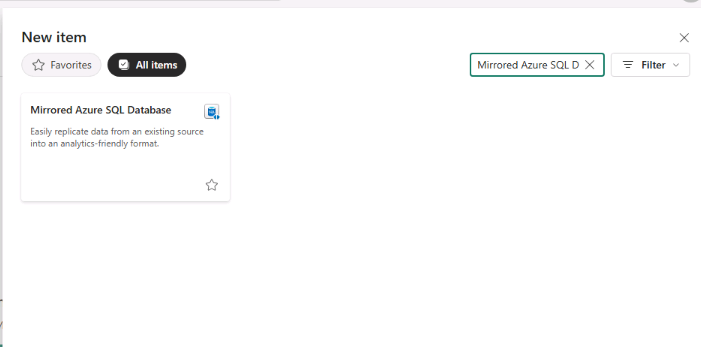
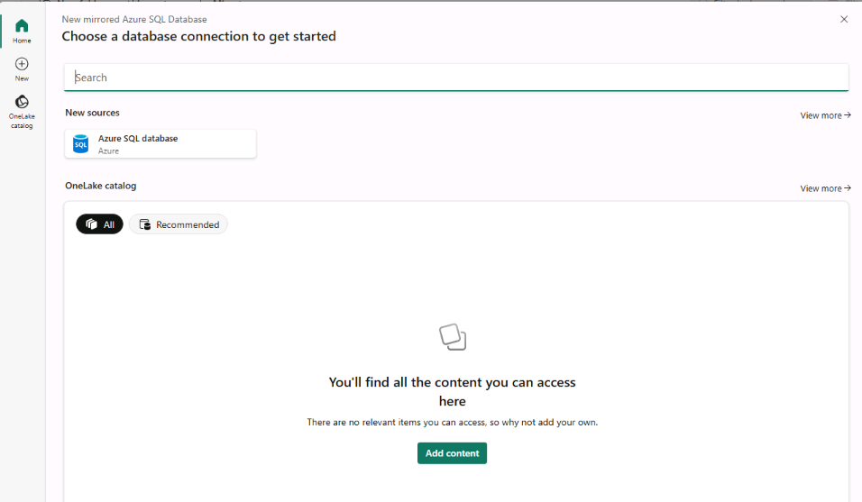

# Exercise 5: Integrate Azure SQL Hyperscale with Microsoft Fabric for Analytics

## Why This Exercise Matters

Your Azure SQL Hyperscale database now supports two very different workloads:

1. **Transactional + AI workloads** — Exercises 1–4 run semantic searches, call Azure OpenAI, and return grounded FAQ answers in milliseconds. This requires a database optimized for point lookups, stored procedure execution, and vector distance calculations.

2. **Analytics workloads** — Business stakeholders want to know: How many FAQs exist per category? Which categories generate the most support requests? Is the content distribution balanced? Analytics queries often scan entire tables, aggregate millions of rows, and run on-demand reports.

These two workload types have **conflicting optimization needs**. Running heavy analytical scans on the same database that serves real-time AI queries can degrade both. The enterprise pattern is to **separate them**: operational data lives in Azure SQL, analytical copies live in a lakehouse.

**Microsoft Fabric Mirroring** makes this separation effortless. Instead of building ETL pipelines, scheduling exports, or managing data transformation, Mirroring continuously replicates changes from Azure SQL into OneLake as Delta Parquet files. No pipeline code. No orchestration. No data engineering team required.

## What Mirroring Is (and Is Not)

| What Mirroring Does | What Mirroring Does Not Do |
|--------------------|--------------------------|
| Replicates row-level changes from Azure SQL to OneLake in near-real time | Replace your transactional database |
| Stores data as open Delta Parquet format — readable by Spark, SQL, notebooks | Require you to write ingestion code |
| Lets you choose which tables to replicate | Replicate all tables by default — you control the scope |
| Automatically handles schema changes | Support every column type (e.g., `VECTOR` columns are excluded here by design) |

> **Why did we exclude `dbo.FAQ_Embeddings`?** The embeddings table contains raw binary vectors optimized for similarity search. They have no meaning in a Power BI report and would add significant storage overhead. The content table is what analysts need. This selective mirroring is a deliberate design choice: replicate only what analytics consumers will actually use.

## What You Will Do

- Enable mirroring for Azure SQL Database in Microsoft Fabric
- Selectively mirror supported tables into OneLake
- Query mirrored data by using the SQL analytics endpoint
- Create a semantic model
- Build a Power BI report on mirrored data
- Explore data lineage across Fabric assets

## Scenario

Your Azure SQL Hyperscale database currently supports two workloads:

- **Transactional and AI workloads** through FAQ content and vector embeddings for semantic search
- **Analytics workloads** for reporting, category insights, and content analysis

Instead of building ETL pipelines, you use Microsoft Fabric Mirroring to replicate only the analytics-ready data into OneLake.

## Architecture Overview

```text
Azure SQL Hyperscale
  FAQ_Content (operational + mirrored)
  FAQ_Embeddings (operational only, not mirrored)
         |
         | Fabric Mirroring (continuous, no ETL)
         v
      OneLake (Delta Parquet)
         |
         v
  SQL analytics endpoint
         |
     +---+---+
     |       |
 Semantic   Power BI
  Model      Report
```

## Task 1: Enable Mirroring for Azure SQL Hyperscale

**What you are configuring:** You are creating a **Mirrored Azure SQL Database** item in Fabric. This item is the connection bridge between your Azure SQL Hyperscale instance and OneLake. Once created, it continuously monitors Azure SQL's transaction log for changes and replicates them to OneLake without any additional configuration.

The connection uses **Basic (SQL) authentication** because the Fabric Mirroring service connects from the cloud and needs a stable credential — Entra ID interactive login is not applicable for a background sync service.

> **Why choose only `dbo.FAQ_Content` and not `dbo.FAQ_Embeddings`?**
> Embeddings are binary vector data with no human-readable meaning. Mirroring them would waste storage and confuse report consumers. Analytics stakeholders need categories, questions, and answers — not 1,536-element float arrays.

1. Open Microsoft Fabric in the browser: [https://app.fabric.microsoft.com](https://app.fabric.microsoft.com)

1. Select `My workspace` and create a new workspace.
1. Select `+ New workspace`.
1. Name the workspace `FAQ-Workspace-{LAB_INSTANCE_ID}`.
1. Select `Apply`.
1. From the workspace, select `+ New Item`.
1. Search for and select `Mirrored Azure SQL Database`.

    

1. Select `Azure SQL Database`.

    

1. Enter the connection details.

    | Setting | Value |
    | --- | --- |
    | Server name | `faq-ai-server-{LAB_INSTANCE_ID}.database.windows.net` |
    | Database | `faq-ai-assistant-db-{LAB_INSTANCE_ID}` |
    | Authentication kind | `Basic` |
    | Username | `adminuser` |
    | Password | `{SQL_PASSWORD}` (from `sqldbhyperscale.env`) |
    | Privacy level | `None` |
    | Use encrypted connection | `Enabled` |

    

Basic authentication corresponds to SQL authentication.

1. Select `Connect`.
1. In the `Choose data` screen, review the available tables:

    - `dbo.FAQ_Content`
    - `dbo.FAQ_Embeddings`

1. Select only `dbo.FAQ_Content` and do not select `dbo.FAQ_Embeddings`.

    

1. Select `Connect`.
1. Confirm the destination name is `faq-ai-assistant-db-{LAB_INSTANCE_ID}`.
1. Select `Create mirrored database`.

1. The expected result:

    - Fabric connects to Azure SQL Hyperscale.
    - Only `FAQ_Content` is selected and begins syncing.
    - Mirrored data is stored in OneLake.
    - No ETL pipelines are required.

    

## Task 2: Verify Data in OneLake

1. Open the mirrored database item.
1. Navigate to `Tables`.
1. Confirm that `FAQ_Content` is available.

    > [!Note]
    > You may need to refresh the tables first.

    

1. Open the mirrored database drop-down and select `SQL analytics endpoint`.

    

1. In the Explorer pane, locate `dbo.FAQ_Content`.

    

1. Select `New SQL query`, then run the following query.

    ```sql
    SELECT TOP 10 *
    FROM FAQ_Content;
    ```

## Task 3: Create a Power BI Semantic Model and Report

> **Concept: What Is a Semantic Model?**
>
> A semantic model (formerly called a Power BI dataset) is a layer that sits between raw data and reports. It defines business-friendly names for columns, relationships between tables, measures (calculated aggregations), and access rules. Reports built on the same semantic model always use consistent, governed definitions.
>
> In this lab, the semantic model wraps the mirrored `FAQ_Content` table and uses **Direct Lake on SQL** storage mode. This means Power BI reads directly from the OneLake Delta files rather than importing data into Power BI's own cache — so reports always reflect the current state of mirrored data.

1. Return to the mirrored database item.

    

1. Select `Create semantic model` and use the following settings.

    | Setting | Value |
    | --- | --- |
    | Semantic model name | `FAQ_Content` |
    | Workspace | `FAQ-Workspace-{LAB_INSTANCE_ID}` |
    | Storage mode | `Direct Lake on SQL` |
    | Tables | `FAQ_Content` |

    

1. Select `Confirm` and wait for semantic model creation to finish.
1. Open the `FAQ-Workspace-{LAB_INSTANCE_ID}` workspace.
1. In the resource list, open the ellipsis next to the `FAQ_Content` semantic model and select `Create report`.

    

1. On the command bar, select `Copilot`.
1. In Copilot Chat, submit the following prompt:

    ```text
    What's in my data?
    ```

1. Review the response.
1. Submit the next prompt:

    ```text
    FAQ count by category
    ```

1. Review the response.
1. Select `File`, then select `Save`.
1. Save the report as `FAQ_rpt`.

## Task 4: Explore Lineage

1. Return to `FAQ-Workspace-{LAB_INSTANCE_ID}` and select `Lineage view`.

    

1. Review the data flow between components. You should see relationships such as:

    ```text
    Azure SQL Database
    -> Mirrored Database
    -> SQL Analytics Endpoint / Semantic Model
    -> Power BI Report
    ```

    

## Task 5: Understand the Split Architecture

At this point, your system follows a modern enterprise pattern.

1. AI and RAG layer:

    - Azure SQL
    - `FAQ_Content`
    - `FAQ_Embeddings` (VECTOR)
    - Used by Foundry Agents and MCP

1. Analytics layer:

    - Fabric
    - Mirrored `FAQ_Content`
    - Lakehouse or Warehouse
    - Power BI

### Task 5.1: Why this matters

- Optimized performance for each workload
- No duplication of logic
- Minimal data engineering effort

1. What you built:

    ```text
    Azure SQL Hyperscale (operational and AI)
    -> Fabric Mirroring (no ETL)
    -> OneLake (auto-synced)
    -> Lakehouse / Warehouse
    -> Power BI analytics
    ```

Next → [6. Expose Azure SQL Hyperscale to AI Agents through MCP](../Instructions/exercise-06.md)
