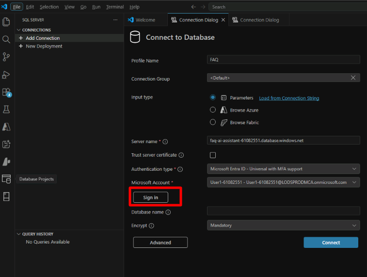

# Exercise 1: AI-Enhanced Querying with Azure SQL Hyperscale

In this exercise, you use Visual Studio Code to connect to Azure SQL Hyperscale, inspect the FAQ knowledge base, and run a semantic search query by using vector embeddings.

By the end of this exercise, you will be able to:

- Connect to Azure SQL by using Visual Studio Code
- Explore FAQ data stored in the database
- Inspect vector embeddings
- Run a semantic similarity query to retrieve relevant FAQ answers

> [!Tip]
> If you have not already prepared the required accounts, tools, and lab assets, complete [Exercise 00](../Instructions/exercise-00.md) before starting this exercise.

## Task 1: Connect to the Lab Database

1. Open Visual Studio Code from the desktop.
1. Select the SQL Server icon in the Activity Bar.

    

1. In Connections, select `+ Add Connection`.

    

1. Configure the connection to the lab database.

    | Setting | Value |
    | --- | --- |
    | Profile Name | `FAQ` |
    | Input type | `Parameters` |
    | Server name | `faq-ai-assistant-{LAB_INSTANCE_ID}.database.windows.net` |
    | Authentication type | `Microsoft Entra ID - Universal with MFA support` |
    | Database name | `faq-ai-assistant-db` |
    | Encrypt | `Mandatory` |

    

1. Select `Sign in` and authenticate with your Microsoft Entra ID account.

    | Setting | Value |
    | --- | --- |
    | Username | `{USERNAME}` |
    | TAP | `{ACCESSTOKEN}` |

    

1. Close the browser tab after signing in.
1. Select `Connect`.

    

1. In the SQL Server extension panel, hover over the new connection and verify that the `faq-ai-assistant-db` database is available.
1. Open a new SQL query window by selecting **View** > **Command Palette** > `MS SQL: New Query`.

## Task 2: Explore the FAQ Knowledge Base

1. Run the following query to view the FAQ content table.

    ```sql
    SELECT TOP 10 *
    FROM dbo.FAQ_Content;
    ```

1. Review the results. You should see columns such as `faq_id`, `category`, `question`, and `answer`.

    Example:

    ```text
    faq_id  category  question
    1       Orders    How do I track my order?
    ```

    

This table stores the FAQ knowledge base used by the AI assistant.

## Task 3: Inspect the Embeddings Table

1. Run the following query to view the embeddings table.

    ```sql
    SELECT TOP 5 *
    FROM dbo.FAQ_Embeddings;
    ```

1. Review the results. You should see:

    - `faq_id`
    - `question_embedding`

    

> [!Note]
> The `question_embedding` column stores a vector representation of each question. These vectors were generated earlier by using Azure OpenAI embeddings. Each embedding contains 1,536 numeric values that represent semantic meaning.

## Task 4: Validate Data Loaded Correctly

1. Confirm how many FAQ records exist.

    ```sql
    SELECT COUNT(*) AS faq_count
    FROM dbo.FAQ_Content;
    ```

1. Confirm how many embeddings were loaded.

    ```sql
    SELECT COUNT(*) AS embedding_count
    FROM dbo.FAQ_Embeddings;
    ```

    

1. Compare the results. Both counts should match. This confirms that every FAQ question has a corresponding embedding.

## Task 5: Run a Semantic Search Query

1. Assume a user asks the following question:

    ```text
    My product arrived damaged.
    ```

1. Call the stored procedure that generates the query embedding and performs the vector search.

    ```sql
    EXEC dbo.SearchFAQ @user_question = N'My product arrived damaged';
    ```

1. Review the results. The procedure returns the most relevant FAQ rows, typically the top three, and usually includes these columns:

    - `faq_id`
    - `category`
    - `question`
    - `answer`

    

1. Results are ordered by semantic similarity, so the top rows are the most relevant. You should see entries such as:

    - `How do I return a damaged item?`
    - `What if I received the wrong item?`

Notice that the wording does not need to match exactly. Vector search finds similar meaning rather than exact keywords.

> [!Note]
> The **@user_question** input is sent to the embedding service inside the procedure and the resulting vector is used to search **dbo.FAQ_Embeddings**.

1. Try Another Example by asking a second question.

    ```text
    Where can I check my delivery status?
    ```

1. Call the stored procedure again.

    ```sql
    EXEC dbo.SearchFAQ @user_question = N'Where can I check my delivery status?';
    ```

1. Review the results. You should see an FAQ similar to `How do I track my order?`

## Task 6: Compare Keyword Search and Semantic Search

1. Reuse the same question.

    ```text
    Where can I check my delivery status?
    ```

1. Run a traditional keyword search.

    ```sql
    SELECT TOP 3 c.faq_id, c.category, c.question, c.answer
    FROM dbo.FAQ_Content AS c
    WHERE c.question LIKE N'%delivery status%';
    ```

    Example result:

    ```sql
    -- No rows returned (keyword mismatch)
    ```

1. Run the semantic search again.

    ```sql
    EXEC dbo.SearchFAQ @user_question = N'Where can I check my delivery status?';
    ```

    Example illustrative result:

    ```text
    faq_id | category | question                 | answer
    -------+----------+--------------------------+--------------------------------
    1      | Orders   | How do I track my order? | You can track your order from...
    ```

The stored procedure understands intent and returns the relevant FAQ.

Next → [2. Accelerate SQL Development with GitHub Copilot](../Instructions/exercise-02.md)
