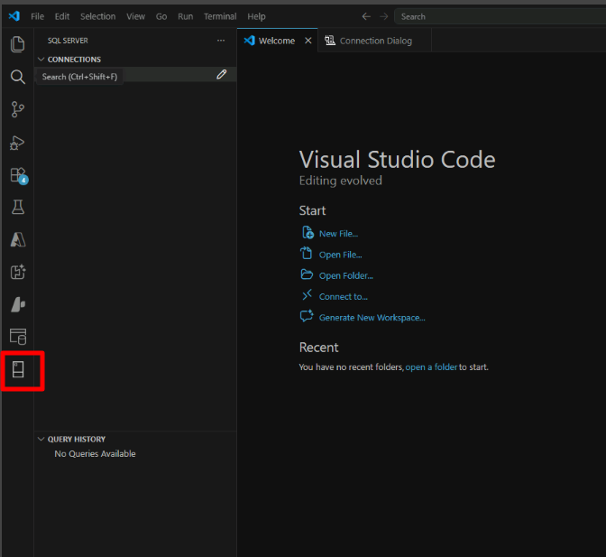
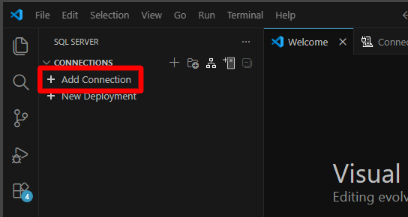
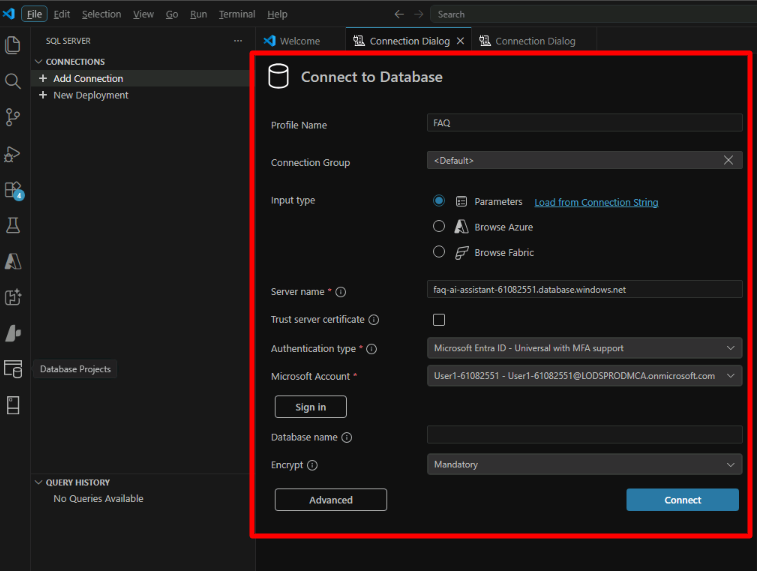
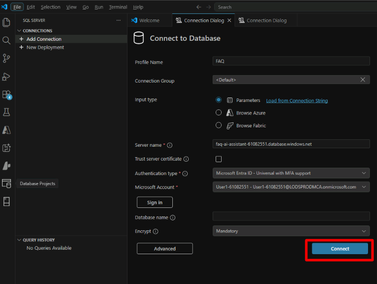
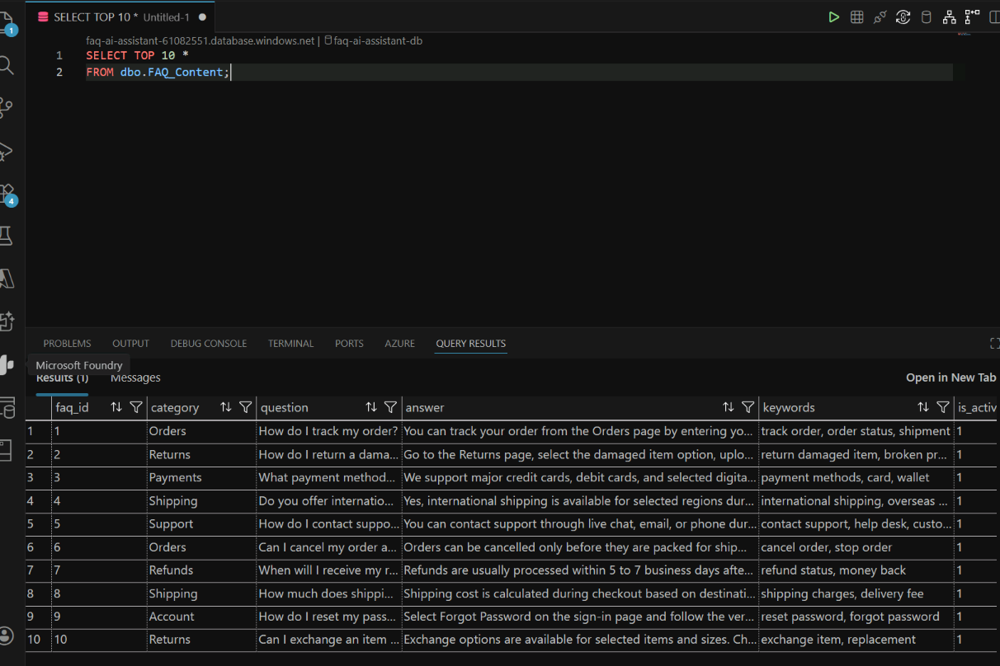
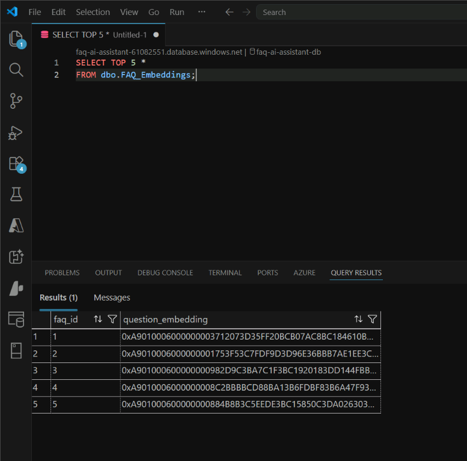
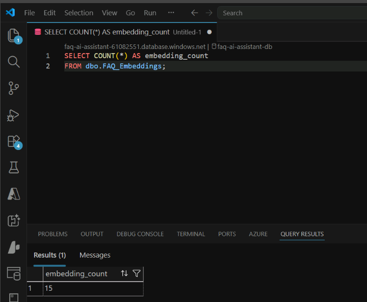
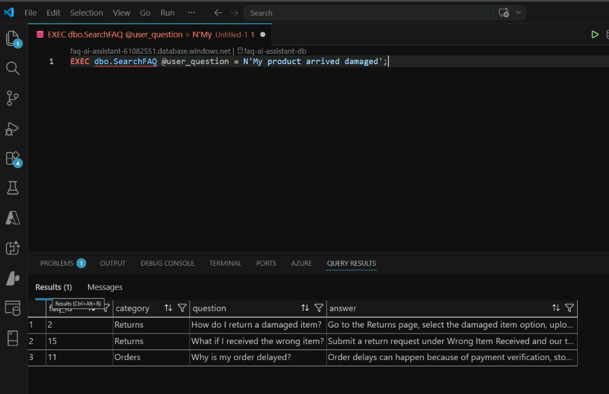

# Exercise 1: AI-Enhanced Querying with Azure SQL Hyperscale

## Why This Exercise Matters

Before you can build an AI assistant, you need to understand the data it will reason over and how that data is stored to support both traditional and AI-driven queries. This exercise gives you a direct look at the FAQ knowledge base and introduces the concept of **vector embeddings** — the numerical representations that make semantic search possible.

By the end of this exercise, you will understand:
- Why the FAQ content and embeddings are stored in *separate* tables
- What a vector embedding looks like and what it represents
- Why semantic search can find relevant answers even when the user's words do not match the FAQ wording exactly
- How a stored procedure encapsulates the full semantic search flow

## The Big Picture: Two Tables, One Idea

The FAQ system uses a deliberate two-table design:

| Table | What it stores | Why separate? |
|-------|---------------|---------------|
| `dbo.FAQ_Content` | Human-readable text: questions, answers, categories | Optimized for reading, filtering, and joining |
| `dbo.FAQ_Embeddings` | Vector representations of each question (1,536 numbers) | Vectors are large binary objects; separating them keeps `FAQ_Content` lean for non-AI queries |

The two tables are joined on `faq_id`, so every FAQ entry has exactly one embedding. This design lets you serve both classic SQL queries and vector search from the same database without compromise.

> [!Tip]
> If you have not already prepared the required accounts, tools, and lab assets, complete [Exercise 00](../Instructions/exercise-00.md) before starting this exercise.

## By the End of This Exercise, You Will Be Able To

- Connect to Azure SQL by using Visual Studio Code
- Explore FAQ data stored in the database
- Inspect vector embeddings
- Run a semantic similarity query to retrieve relevant FAQ answers

## Task 1: Connect to the Lab Database

You will use the **MSSQL extension for VS Code** rather than a standalone SQL client. This keeps everything in your development environment — you can write code, run queries, and inspect results without switching applications. Throughout this lab you will go back and forth between SQL queries and Copilot Chat, so having both in the same window matters.

> [!Tip]
> Your SQL connection details are in the `sqldbhyperscale.env` file generated by the provisioning script in Exercise 0. Source it to load the values into your shell:
> ```bash
> source ./installation-script/sqldbhyperscale.env
> echo $SQL_SERVER   # gives your LAB_INSTANCE_ID suffix
> echo $SQL_PASSWORD  # copy this for the password field
> ```

1. Open Visual Studio Code from the desktop.
1. Select the SQL Server icon in the Activity Bar.

    

1. In Connections, select `+ Add Connection`.

    

1. Configure the connection to the lab database.

    | Setting | Value |
    | --- | --- |
    | Profile Name | `FAQ` |
    | Input type | `Parameters` |
    | Server name | `faq-ai-server-{LAB_INSTANCE_ID}.database.windows.net` |
    | Authentication type | `SQL Login` |
    | User name | `adminuser` |
    | Password | `{SQL_PASSWORD}` (from `sqldbhyperscale.env`) |
    | Database name | `faq-ai-assistant-db-{LAB_INSTANCE_ID}` |
    | Encrypt | `Mandatory` |

    

1. Select `Connect`.

    

1. In the SQL Server extension panel, hover over the new connection and verify that your database is available.
1. Open a new SQL query window by selecting **View** > **Command Palette** > `MS SQL: New Query`.

## Task 2: Explore the FAQ Knowledge Base

Before running AI-powered queries, it is worth looking at the raw data. Understanding the schema helps you reason about what the AI assistant will and will not be able to answer — if a topic is not in the FAQ, the grounded assistant (which you build in Exercise 3) will say so rather than invent an answer.

1. Run the following query to view the FAQ content table.

    ```sql
    SELECT TOP 10 *
    FROM dbo.FAQ_Content;
    ```

1. Review the results. You should see columns such as `faq_id`, `category`, `question`, and `answer`.

    Example:

    ```text
    faq_id  category  question
    1       Orders    How do I track my order?
    ```

    

This table stores the FAQ knowledge base used by the AI assistant.

## Task 3: Inspect the Embeddings Table

> **Concept: What Is a Vector Embedding?**
>
> A vector embedding is a list of floating-point numbers that represents the *semantic meaning* of a piece of text. Think of it as a point in a very high-dimensional space where texts with similar meaning end up close together — even if they use completely different words.
>
> For example, "My package hasn't arrived" and "Where is my order?" would have embeddings that are geometrically close, while "My package hasn't arrived" and "How do I reset my password?" would be far apart.
>
> In this lab, each FAQ question was passed through **Azure OpenAI's `text-embedding-3-small` model**, which outputs a 1,536-number vector. Those vectors are stored in `dbo.FAQ_Embeddings`. When a user asks a new question, the same embedding model converts their question into a vector, and then SQL finds the stored FAQ vectors that are closest to it — that is the semantic search.

1. Run the following query to view the embeddings table.

    ```sql
    SELECT TOP 5 *
    FROM dbo.FAQ_Embeddings;
    ```

1. Review the results. You should see:

    - `faq_id`
    - `question_embedding`

    

> [!Note]
> The `question_embedding` column stores a vector representation of each question. These vectors were generated earlier by using Azure OpenAI embeddings. Each embedding contains 1,536 numeric values that represent semantic meaning.

## Task 4: Validate Data Loaded Correctly

1. Confirm how many FAQ records exist.

    ```sql
    SELECT COUNT(*) AS faq_count
    FROM dbo.FAQ_Content;
    ```

1. Confirm how many embeddings were loaded.

    ```sql
    SELECT COUNT(*) AS embedding_count
    FROM dbo.FAQ_Embeddings;
    ```

    

1. Compare the results. Both counts should match. This confirms that every FAQ question has a corresponding embedding.

## Task 5: Run a Semantic Search Query

> **Concept: How `dbo.SearchFAQ` Works Internally**
>
> The stored procedure does the following in a single call:
> 1. Takes the user's question as input (`@user_question`).
> 2. Calls Azure OpenAI via `sp_invoke_external_rest_endpoint` to generate an embedding for that question.
> 3. Uses `VECTOR_DISTANCE('cosine', user_vector, stored_vector)` to compute the similarity between the user's embedding and every embedding in `dbo.FAQ_Embeddings`. A smaller cosine distance means more similar.
> 4. Joins back to `dbo.FAQ_Content` and returns the top 3 closest matches.
>
> All of this happens inside SQL — your application sends one `EXEC` call and gets back grounded FAQ results. This is a key design pattern: **keep retrieval logic in the database** so any consumer (a Python app, a DAB API, a Foundry Agent) gets identical, consistent results.

1. Assume a user asks the following question:

    ```text
    My product arrived damaged.
    ```

1. Call the stored procedure that generates the query embedding and performs the vector search.

    ```sql
    EXEC dbo.SearchFAQ @user_question = N'My product arrived damaged';
    ```

1. Review the results. The procedure returns the most relevant FAQ rows, typically the top three, and usually includes these columns:

    - `faq_id`
    - `category`
    - `question`
    - `answer`

    

1. Results are ordered by semantic similarity, so the top rows are the most relevant. You should see entries such as:

    - `How do I return a damaged item?`
    - `What if I received the wrong item?`

Notice that the wording does not need to match exactly. Vector search finds similar meaning rather than exact keywords.

> [!Note]
> The **@user_question** input is sent to the embedding service inside the procedure and the resulting vector is used to search **dbo.FAQ_Embeddings**.

1. Try Another Example by asking a second question.

    ```text
    Where can I check my delivery status?
    ```

1. Call the stored procedure again.

    ```sql
    EXEC dbo.SearchFAQ @user_question = N'Where can I check my delivery status?';
    ```

1. Review the results. You should see an FAQ similar to `How do I track my order?`

## Task 6: Compare Keyword Search and Semantic Search

This is the most important conceptual demonstration in Exercise 1. Most developers default to `LIKE` or `CONTAINS` because that is what SQL has offered for decades. This task shows you the gap — and why closing that gap with vector search matters for support assistants and knowledge bases.

The key insight: a user does not know the exact wording of the FAQ. They describe their situation in their own words. Keyword search penalizes them for that. Semantic search does not.

1. Reuse the same question.

    ```text
    Where can I check my delivery status?
    ```

1. Run a traditional keyword search.

    ```sql
    SELECT TOP 3 c.faq_id, c.category, c.question, c.answer
    FROM dbo.FAQ_Content AS c
    WHERE c.question LIKE N'%delivery status%';
    ```

    Example result:

    ```sql
    -- No rows returned (keyword mismatch)
    ```

1. Run the semantic search again.

    ```sql
    EXEC dbo.SearchFAQ @user_question = N'Where can I check my delivery status?';
    ```

    Example illustrative result:

    ```text
    faq_id | category | question                 | answer
    -------+----------+--------------------------+--------------------------------
    1      | Orders   | How do I track my order? | You can track your order from...
    ```

The stored procedure understands intent and returns the relevant FAQ.

Next → [2. Accelerate SQL Development with GitHub Copilot](../Instructions/exercise-02.md)
