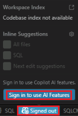
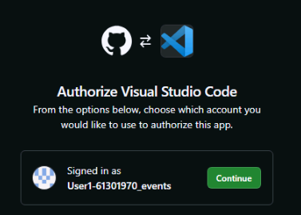

# Exercise 2: Accelerate SQL Development with GitHub Copilot

## Why This Exercise Matters

In Exercise 1 you ran pre-built queries and a pre-built stored procedure. In real projects, you write that SQL from scratch — and that is where GitHub Copilot changes the workflow.

Copilot does not replace your SQL expertise. Instead, it acts as a **knowledgeable pair programmer** that drafts boilerplate quickly, explains unfamiliar patterns, and suggests improvements you might not have considered. Your role shifts from syntax recall to **critical review**: reading what Copilot generates, validating it against your schema and requirements, and refining it until it is correct and production-ready.

This exercise teaches that discipline. You will ask Copilot to generate a semantic search query, then compare it against the validated version from Exercise 1. That comparison teaches you both what Copilot gets right and where to apply your own judgment.

## By the End of This Exercise, You Will Be Able To

- Use GitHub Copilot Chat in Visual Studio Code
- Ask Copilot to generate a semantic search query
- Ask Copilot to explain and improve SQL
- Refine AI-generated SQL before using it in the lab

> **Key Mental Model: Copilot as a Draft, You as the Editor**
>
> AI-generated SQL can be subtly wrong in ways that compile and run but return incorrect results. Always validate:
> - Are the table and column names correct for **your** schema?
> - Is the `VECTOR_DISTANCE` argument order correct? (Azure SQL expects the metric first, then the two vectors.)
> - Does the query return the right number of rows in the right order?
> - Would this run safely in production (no missing filters, no unbounded scans)?
>
> Copilot is fastest when you already know what correct looks like — this exercise gives you that baseline.

## Task 1: Accept the GitHub Organization Invitation and Sign in to GitHub Copilot

> [!Important]
> You must **accept the GitHub organization invitation from your email before signing into VS Code**. The invitation is what grants your personal GitHub account access to GitHub Copilot through the workshop organization. Signing in before accepting means Copilot will not activate, and you will need to sign out and back in.

**Step 1: Accept the invitation (if you have not already done so)**

1. Check your personal email inbox for a message from GitHub with a subject similar to *"You've been invited to join [organization name] on GitHub"*.
1. Open the email and select **View invitation**.
1. On the GitHub invitation page, select **Accept invitation**.
1. Confirm the organization now appears in your GitHub profile at `https://github.com/settings/organizations`.

    > [!Note]
    > If you do not see the invitation, check your spam folder. Contact the workshop organizer if it has not arrived. You can also visit `https://github.com/settings/copilot` to verify that your account has an active Copilot subscription after accepting.

**Step 2: Sign in to VS Code with your GitHub account**

1. In Visual Studio Code, select the **Accounts** icon in the lower-left activity bar.
1. Select **Sign in with GitHub to use GitHub Copilot**.

    

1. Your browser opens to `github.com`. Sign in with your personal GitHub credentials.
1. Select **Authorize Visual-Studio-Code**, then select **Open** (or **Allow** in the browser security dialog).

    

1. Back in VS Code, confirm Copilot is active by opening Copilot Chat (`Ctrl+Alt+I`). You should see the chat pane without any sign-in prompt.

## Task 2: Generate a Semantic Search Query

**Why generate a query you already have?** Because the process of asking Copilot, reviewing what it produces, and comparing it to the known-correct version builds intuition for what good AI-generated SQL looks like. You are not looking for a shortcut here — you are developing a review muscle.

1. Open a new SQL query window by selecting **View** > **Command Palette** > `MS SQL: New Query`.

1. Open Copilot Chat in Visual Studio Code. If the chat pane is not visible, select `View`, then select `Chat`.

    

1. Enter a prompt like the following:

    ```text
    By using SQL Server and Microsoft Learn MCP tools, generate a T-SQL query for Azure SQL that returns the top 3 FAQ items most relevant to a customer question by using dbo.FAQ_Content and dbo.FAQ_Embeddings.
    ```

If you see a permission prompt, select `Allow in this Session`.


1. Review the SQL returned by Copilot. Do not run it yet check whether it includes:

    - `dbo.FAQ_Content`
    - `dbo.FAQ_Embeddings`
    - A join on `faq_id`
    - `TOP 3`
    - `VECTOR_DISTANCE`

1. Copy the Copilot-generated SQL into your query window or SQL file.
1. Compare the Copilot-generated SQL with the semantic search query from Exercise 1.

    - Look for similarities and differences.
    - Notice whether Copilot used the correct `VECTOR_DISTANCE` argument order.

> [!Important]
> Azure SQL expects the metric as the first argument to `VECTOR_DISTANCE`, followed by the two vector values. If needed, keep the lab's validated query as the final version.

1. Ask Copilot to Explain the Query. In Copilot Chat, enter a prompt like the following:

    ```text
    Explain this SQL query step by step for someone who is new to vector search in Azure SQL.
    ```

1. Review the explanation. Notice how Copilot breaks down:

    - The join between the two tables
    - The similarity calculation
    - Why the results are ordered by vector distance

1. Ask Copilot to Improve Readability. In Copilot Chat, enter a prompt like the following:

    ```text
    Rewrite this query to make it easier to read for a lab demo. Add clean formatting and brief comments.
    ```

1. Copy the improved version into your SQL file.

## Task 3: Ask Copilot for Schema Suggestions

**Why ask an AI about your schema?** Schema design has long-term consequences — a poorly designed index, a missing foreign key, or an overly wide table column type can quietly degrade performance as data grows. Copilot has been trained on a large body of SQL best practices and can surface suggestions you might not think of in the moment. Treat the suggestions as a checklist to review, not a prescription to blindly apply.

1. In Copilot Chat, enter a prompt like the following:

    ```text
    By using SQL Server tool, review the schema for dbo.FAQ_Content and dbo.FAQ_Embeddings and suggest improvements.
    ```

1. Review the suggestions. Look for ideas such as:

    - Readability and documentation improvements
    - Indexing considerations
    - Separation of content and embeddings
    - Column type suggestions

## Task 4: Ask Copilot to Draft a Stored Procedure

**Why draft a stored procedure with Copilot?** Stored procedures are reusable SQL units that encapsulate complex logic. In Exercise 3, the `dbo.SearchFAQ` procedure is the backbone of the RAG workflow. Drafting a similar procedure with Copilot shows you how quickly you could build or extend such components in a real project — and practises the review discipline from Task 2 at a larger scale.

1. In Copilot Chat, enter a prompt like the following:

    ```text
    Generate a stored procedure draft for Azure SQL called dbo.usp_GetTopFaqMatches that returns the most relevant FAQ rows for a user question.
    ```

1. Review the stored procedure returned by Copilot.

> [!Note]
> You do not need to deploy it yet. This step demonstrates how Copilot can accelerate repeatable SQL authoring patterns.

## Task 5: Wrap Up

1. Ask one final prompt.

    ```text
    Summarize in 3 bullet points how GitHub Copilot helped improve SQL development in this exercise.
    ```

1. Review the summary. Copilot should help with:

    - Generating SQL
    - Explaining SQL
    - Refining SQL structure

Next → [3. Implement Retrieval-Augmented Generation (RAG) with Azure SQL Hyperscale](../Instructions/exercise-03.md)
