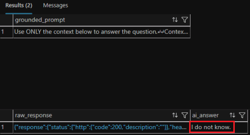

# Exercise 3: Implement Retrieval-Augmented Generation (RAG) with Azure SQL Hyperscale

In this exercise, you implement a simple Retrieval-Augmented Generation (RAG) workflow by using Azure SQL Hyperscale.

You will:

- Pass a natural language question
- Retrieve the most relevant FAQ entries from Azure SQL Hyperscale
- Assemble the retrieved answers into a grounding context
- Build a grounded prompt inside SQL
- Send the prompt to GPT-5-mini
- Review the AI-generated answer

By the end of this exercise, you will understand how Azure SQL Hyperscale supports retrieval and prompt orchestration in a RAG workflow.

## Scenario

Contoso Support wants to build an FAQ assistant that answers customer questions by using only approved support content.

To accomplish this, the system must:

1. Accept a user question in natural language.
1. Retrieve relevant FAQ records.
1. Combine those records into a grounding context.
1. Build a prompt for an AI model.
1. Generate a grounded response by using GPT-5-mini.

## Task 1: Retrieve FAQ Data and Build the Grounding Context

1. Open a new SQL query window in Visual Studio Code by selecting **View** > **Command Palette** > `MS SQL: New Query`.

1. Execute the stored procedure that retrieves relevant FAQ matches.

    ```sql
    EXEC dbo.SearchFAQ @user_question = N'My product arrived damaged';
    ```

1. Review the results. You should see top matches such as:

    - `How do I return a damaged item?`
    - `What if I received the wrong item?`

1. Build the grounding context from the same retrieval flow.

    ```sql
    DECLARE @user_question NVARCHAR(1000) = N'My product arrived damaged';
    DECLARE @context NVARCHAR(MAX);
    DECLARE @prompt NVARCHAR(MAX);
    
    CREATE TABLE #searchResults (
        faq_id INT,
        category NVARCHAR(200),
        question NVARCHAR(MAX),
        answer NVARCHAR(MAX)
    );
    
    INSERT INTO #searchResults (faq_id, category, question, answer)
    EXEC dbo.SearchFAQ @user_question = @user_question;
    
    SELECT @context =
    (
        SELECT STRING_AGG(
            CONCAT(
                'Question: ', question, CHAR(10),
                'Answer: ', answer
            ),
            CHAR(10) + CHAR(10)
        )
        FROM #searchResults
    );
    
    SET @prompt =
    N'Use ONLY the context below to answer the question.
    Context:
    ' + ISNULL(@context, N'No relevant FAQ context found.') + N'
    Question:
    ' + @user_question + N'
    If the answer is not in the context, say you do not know.';
    
    SELECT @prompt AS grounded_prompt;
    
    DROP TABLE #searchResults;
    ```

1. Run the script and review the `grounded_prompt` result in text view. The prompt contains:

    - The retrieved FAQ context
    - The user question
    - Instructions that force the AI to stay grounded in the data

## Task 2: Send the Prompt to GPT-5-mini

1. Append a chat-completions call pattern to the same query window so Azure SQL Hyperscale can call the model with the grounded prompt.

    ```sql
    DECLARE @payload NVARCHAR(MAX);
    DECLARE @response NVARCHAR(MAX);
    DECLARE @headers NVARCHAR(MAX) = N'{"api-key": ""}';
    
    SET @payload = N'{' +
    N'"messages":[' +
    N'{"role":"system","content":"You are a helpful assistant that answers questions by using only approved FAQ context."},' +
    N'{"role":"user","content":"' + STRING_ESCAPE(@prompt, 'json') + N'"}' +
    N']' +
    N'}';
    
    EXEC sp_invoke_external_rest_endpoint
        @method = 'POST',
        @url = N'',
        @headers = @headers,
        @payload = @payload,
        @response = @response OUTPUT;
    
    SELECT
        @response AS raw_response,
        COALESCE(
            JSON_VALUE(@response, '$.result.choices[0].message.content'),
            JSON_VALUE(@response, '$.choices[0].message.content'),
            JSON_VALUE(@response, '$.output[0].content[0].text'),
            @response
        ) AS ai_answer;
    ```

1. Run the script and review the response.

    

1. Change the user question.

    ```sql
    DECLARE @user_question NVARCHAR(1000) = N'How do I track my order?';
    ```

1. Run the script again and review the updated outputs:

    - Retrieved context
    - Grounded prompt
    - AI answer

1. Now, try a question that may not exist in the FAQ.

    ```sql
    DECLARE @user_question NVARCHAR(1000) = N'Can I pay using cryptocurrency?';
    ```

    

1. Run the script again and review the results.

    - If the FAQ does not contain relevant information, the model should answer with a grounded fallback such as `I do not know.` This demonstrates how RAG grounding helps reduce hallucinations.

    

## What You Built

1. You implemented a complete RAG workflow by using Azure SQL:

    ```text
        User question
        -> Azure SQL retrieval
        -> Top FAQ rows
        -> Context assembly
        -> Grounded prompt
        -> GPT-4o generation
        -> Grounded AI answer
    ```

Next → [4. Orchestrate the AI FAQ Workflow with Microsoft Foundry Agents](../Instructions/exercise-04.md)
