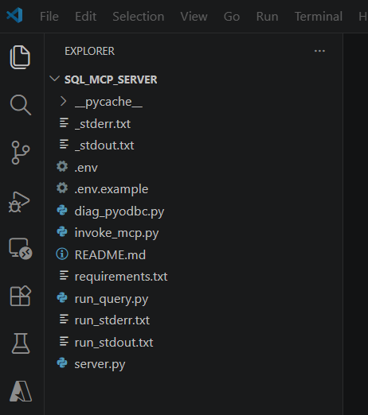
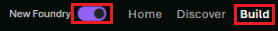
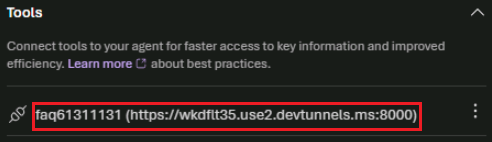

# Exercise 4: Orchestrate the AI FAQ Workflow with Microsoft Foundry Agents

In this exercise, you use Microsoft Foundry Agents to orchestrate the FAQ workflow end to end.

You configure an agent that can:

- Receive a natural language support question
- Call an MCP tool
- Use that tool to retrieve FAQ matches from your service
- Ground the response by using approved FAQ content
- Return a final answer to the user

For this exercise, the MCP tool runs locally on your machine and is exposed securely to Foundry by using dev tunnel.

## Architecture Flow

```text
User question
-> Microsoft Foundry Agent
-> MCP tool call
-> Local MCP server
-> FAQ retrieval and business logic
-> Tool result returned to agent
-> Grounded final response
```

## Scenario

So far, you have:

- Stored FAQ content in Azure SQL Hyperscale
- Used vector search to retrieve relevant FAQ entries
- Built a grounded prompt for GPT-5-mini

Now you move the orchestration layer into Microsoft Foundry Agents so the agent can decide when to call the MCP tool, retrieve relevant FAQ content, and generate a grounded response.

## Task 1: Start the Local MCP Tool

1. In Visual Studio Code, press `Ctrl + Shift + E` to open Explorer.
1. Select `Open Folder` and navigate to `C:\LabFiles\sql_mcp_server`.
1. Select `Select folder`.
1. Select `Don't Save` if prompted.
1. Select `Yes, I trust the authors`.

    

1. Open a new terminal window by selecting **Terminal** > **New Terminal**.

1. Create and activate a Python virtual environment.

    ```powershell
    python -m venv .venv
    .\.venv\Scripts\Activate.ps1
    ```

1. Install the required dependencies.

    ```powershell
    pip install -r requirements.txt
    ```

1. Start the MCP server.

    ```powershell
    python server.py
    ```

1. Select `Allow` on the Windows Security popup. Verify that the server is running.

1. You should see an output similar to the following in the terminal:

    ```text
    [MCP] Starting FAQ SQL Assistant on http://0.0.0.0:8000
    [MCP] MCP endpoint : http://0.0.0.0:8000/mcp
    ```

Keep this terminal running.

## Task 2: Expose the Local MCP Server with Dev Tunnel

1. Open a new terminal window.
1. Sign in to dev tunnel.

    ```bash
    devtunnel user login
    ```

1. Select `Work or school account` and sign in with your Microsoft Entra ID account.

    | Setting | Value |
    | --- | --- |
    | Username | `{USERNAME}` |
    | TAP | `{ACCESSTOKEN}` |

1. Select `Yes`, then select `Done`.
1. Run the tunnel setup commands.

    ```bash
    devtunnel create my-faq-tunnel{LAB_INSTANCE_ID} --allow-anonymous
    devtunnel port create my-faq-tunnel{LAB_INSTANCE_ID} -p 8000 --protocol http
    devtunnel host my-faq-tunnel{LAB_INSTANCE_ID}
    ```

1. Review the output. You should receive a public HTTPS forwarding URL similar to:

    ```text
    https://<your-tunnel-name>.devtunnels.ms:8000
    ```

    

1. Copy the public tunnel URL. You will use it when configuring the MCP tool connection in Foundry.

Keep the dev tunnel running during the exercise.

## Task 3: Add the MCP Tool to the Foundry Agent

1. Open Microsoft Edge and go to `https://ai.azure.com/`.
1. Select `Sign In`.
1. Select the `New Foundry` slider.
1. Select `FAQ-Assistant-project`, then select `Let's go`.
1. Select `Build`.

    

1. Select `Tools` from the left menu, then select the `Tools` tab.
1. Select `Connect a tool`.
1. On the `Custom` tab, choose `Model Context Protocol (MCP)`, then select `Create`.

    

1. Configure the connection.

    | Setting | Value |
    | --- | --- |
    | Name | `faq{LAB_INSTANCE_ID}` |
    | Remote MCP Server endpoint | `<tunnelURL>/mcp` |
    | Authentication | `Unauthenticated` |

1. Select `Connect`.
1. Select `Use in an agent`.
1. Enter `faq-orchestrator-agent` as the agent name.
1. Select `Create and open playground`.
1. In the Instructions card, add guidance like the following:

    ```text
    You are a support FAQ assistant.
    Use the available MCP tool to retrieve relevant FAQ content before answering.
    Answer by using only the tool results when possible.
    If the tool does not return relevant information, say that you do not know.
    Do not invent policies, refunds, shipping details, or support actions that are not present in the FAQ content.
    ```

1. Confirm that Foundry can discover the tool definitions exposed by your MCP server.

    

1. Select `Save` to save the agent configuration.

## Task 4: Test the Agent End to End

1. Open the agent test pane or chat interface in Foundry.
1. Submit a support question.

    ```text
    My product arrived damaged
    ```

    > [!Note]
    > When asked to allow permissions, select `Allow` to enable the agent to call the MCP tool.

    

1. Review the tool activity. You should see the agent invoke the MCP tool before producing a final answer.

1. Review the final answer. The expected behavior:

    - The answer is based on retrieved FAQ content.
    - The answer stays within the approved support knowledge.
    - The response does not invent unsupported details.

> [!Note]
> An expected grounded behavior is that the tool returns an FAQ such as `How do I return a damaged item?` and the agent summarizes that result into a natural response.

### Task 4.1: Try Another Example

1. Ask a second question.

    ```text
    Where can I check my delivery status?
    ```

1. Review the result. The agent should call the MCP tool and return an answer grounded in the FAQ content, such as `How do I track my order?`

### Task 4.2: Test an Unsupported Question

1. Ask a question that may not be covered by the FAQ data.

    ```text
    Can I pay using cryptocurrency?
    ```

1. Review the answer. The expected behavior:

    - The agent may still call the tool.
    - If no relevant FAQ content is returned, the agent should respond with a grounded fallback such as `I do not know based on the available FAQ content.`

This shows that the agent is using retrieval and tool results rather than hallucinating an answer.

Next → [5. Integrate Azure SQL Hyperscale with Microsoft Fabric for Analytics](../Instructions/exercise-05.md)
