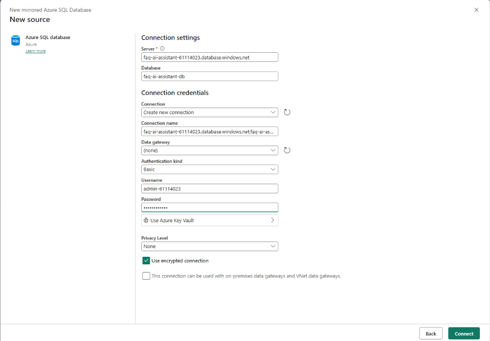
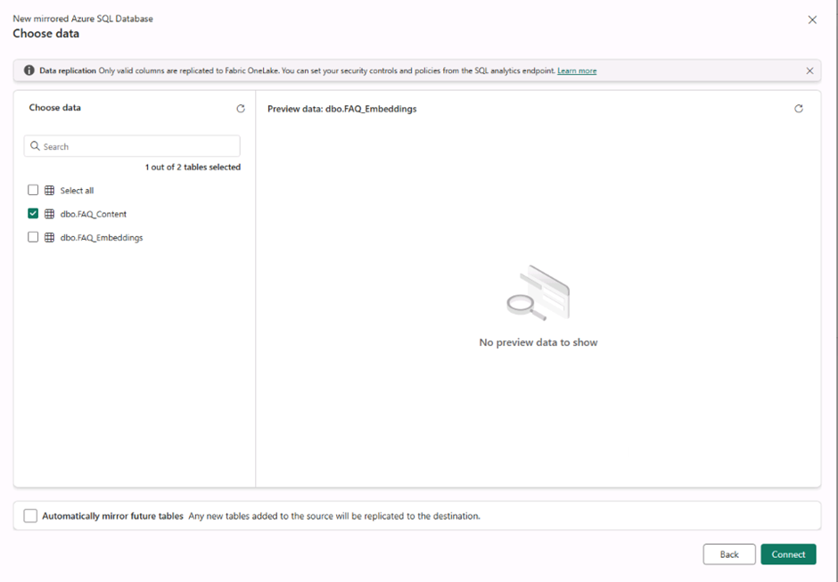
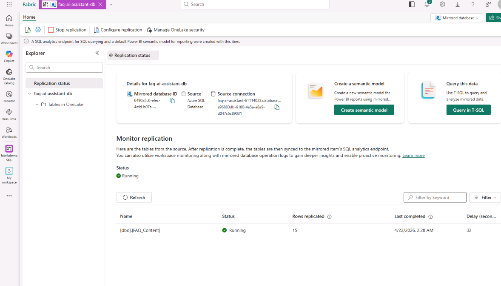
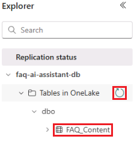
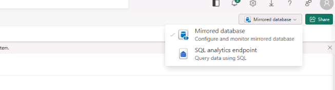
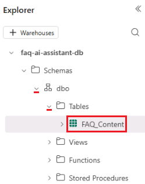
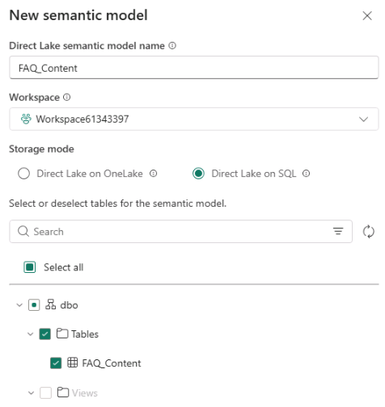
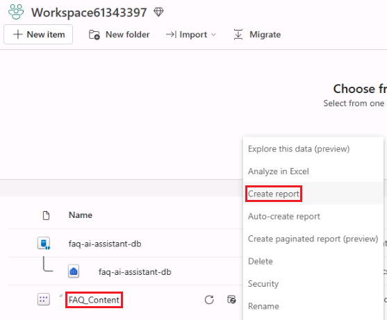
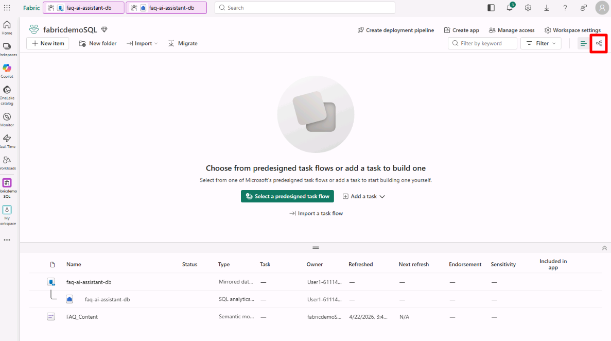
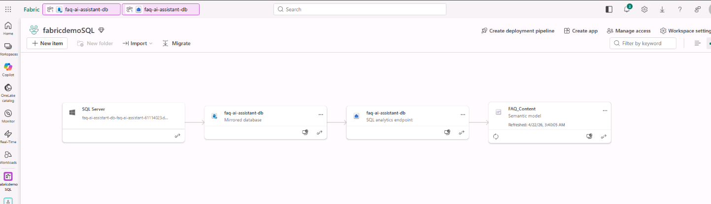

# Exercise 5: Integrate Azure SQL Hyperscale with Microsoft Fabric for Analytics

In this exercise, you enable real-time analytics by mirroring Azure SQL Hyperscale data into Microsoft Fabric without building ingestion pipelines.

You will:

- Enable mirroring for Azure SQL Database in Microsoft Fabric
- Selectively mirror supported tables into OneLake
- Query mirrored data by using the SQL analytics endpoint
- Create a semantic model
- Build a Power BI report on mirrored data
- Explore data lineage across Fabric assets

By the end of this exercise, you will understand how Fabric enables analytics on operational data with minimal engineering effort.

## Scenario

Your Azure SQL Hyperscale database currently supports two workloads:

- **Transactional and AI workloads** through FAQ content and vector embeddings for semantic search
- **Analytics workloads** for reporting, category insights, and content analysis

Instead of building ETL pipelines, you use Microsoft Fabric Mirroring to replicate only the analytics-ready data into OneLake.

## Architecture Overview

```text
Azure SQL Hyperscale
-> FAQ_Content (operational data)
-> Fabric Mirroring
-> OneLake (Delta tables)
-> SQL analytics endpoint
-> Semantic model
-> Power BI report
```

## Task 1: Enable Mirroring for Azure SQL Hyperscale

1. Open Microsoft Fabric in the browser: [https://app.fabric.microsoft.com](https://app.fabric.microsoft.com)

1. Select `My workspace` and create a new workspace.
1. Select `+ New workspace`.
1. Name the workspace `Workspace{LAB_INSTANCE_ID}`.
1. Select `Apply`.
1. From the workspace, select `+ New Item`.
1. Search for and select `Mirrored Azure SQL Database`.

    

1. Select `Azure SQL Database`.

    

1. Enter the connection details.

    | Setting | Value |
    | --- | --- |
    | Server name | `faq-ai-assistant-{LAB_INSTANCE_ID}.database.windows.net` |
    | Database | `faq-ai-assistant-db` |
    | Authentication kind | `Basic` |
    | Username | `admin-{LAB_INSTANCE_ID}` |
    | Password | `{PASSWORD}` |
    | Privacy level | `None` |
    | Use encrypted connection | `Enabled` |

    

Basic authentication corresponds to SQL authentication.

1. Select `Connect`.
1. In the `Choose data` screen, review the available tables:

    - `dbo.FAQ_Content`
    - `dbo.FAQ_Embeddings`

1. Select only `dbo.FAQ_Content` and do not select `dbo.FAQ_Embeddings`.

    

1. Select `Connect`.
1. Confirm the destination name is `faq-ai-assistant-db`.
1. Select `Create mirrored database`.

1. The expected result:

    - Fabric connects to Azure SQL Hyperscale.
    - Only `FAQ_Content` is selected and begins syncing.
    - Mirrored data is stored in OneLake.
    - No ETL pipelines are required.

    

## Task 2: Verify Data in OneLake

1. Open the mirrored database item.
1. Navigate to `Tables`.
1. Confirm that `FAQ_Content` is available.

    > [!Note]
    > You may need to refresh the tables first.

    

1. Open the mirrored database drop-down and select `SQL analytics endpoint`.

    

1. In the Explorer pane, locate `dbo.FAQ_Content`.

    

1. Select `New SQL query`, then run the following query.

    ```sql
    SELECT TOP 10 *
    FROM FAQ_Content;
    ```

## Task 3: Create a Power BI Semantic Model and Report

1. Return to the mirrored database item.

    

1. Select `Create semantic model` and use the following settings.

    | Setting | Value |
    | --- | --- |
    | Semantic model name | `FAQ_Content` |
    | Workspace | `Workspace{LAB_INSTANCE_ID}` |
    | Storage mode | `Direct Lake on SQL` |
    | Tables | `FAQ_Content` |

    

1. Select `Confirm` and wait for semantic model creation to finish.
1. Open the `Workspace{LAB_INSTANCE_ID}` workspace.
1. In the resource list, open the ellipsis next to the `FAQ_Content` semantic model and select `Create report`.

    

1. On the command bar, select `Copilot`.
1. In Copilot Chat, submit the following prompt:

    ```text
    What's in my data?
    ```

1. Review the response.
1. Submit the next prompt:

    ```text
    FAQ count by category
    ```

1. Review the response.
1. Select `File`, then select `Save`.
1. Save the report as `FAQ_rpt`.

## Task 4: Explore Lineage

1. Return to `Workspace{LAB_INSTANCE_ID}` and select `Lineage view`.

    

1. Review the data flow between components. You should see relationships such as:

    ```text
    Azure SQL Database
    -> Mirrored Database
    -> SQL Analytics Endpoint / Semantic Model
    -> Power BI Report
    ```

    

## Task 5: Understand the Split Architecture

At this point, your system follows a modern enterprise pattern.

1. AI and RAG layer:

    - Azure SQL
    - `FAQ_Content`
    - `FAQ_Embeddings` (VECTOR)
    - Used by Foundry Agents and MCP

1. Analytics layer:

    - Fabric
    - Mirrored `FAQ_Content`
    - Lakehouse or Warehouse
    - Power BI

### Task 5.1: Why this matters

- Optimized performance for each workload
- No duplication of logic
- Minimal data engineering effort

1. What you built:

    ```text
    Azure SQL Hyperscale (operational and AI)
    -> Fabric Mirroring (no ETL)
    -> OneLake (auto-synced)
    -> Lakehouse / Warehouse
    -> Power BI analytics
    ```

Next → [6. Expose Azure SQL Hyperscale to AI Agents through MCP](../Instructions/exercise-06.md)
